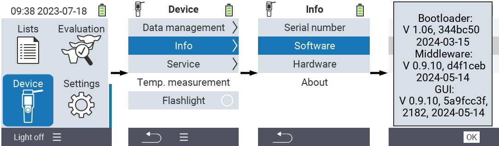

## Determine firmware versions installed on your device

1. Open the menu item `Device` in the main screen of your VitalControl device.

2. Invoke the submenu `Info`, select the menu item `Software` and confirm with `OK`. A pop-up window opens which lists the software versions currently installed on your device:

## Latest firmware versions:

The following table lists the current firmware versions:

|                 | GUI-Firmware | Middleware  | Bootloader |
|-----------------|:------------:|:-----------:|:----------:|
| **Version**     | 0.9.9        | 0.9.9       | 1.0.4      |
| **Date**        | 2023-07-07   | 2023-07-07  | 2023-05-03 |
| **Commit hash** | aa177e1a     | 8e40109     | d3d2a3d    |
| **Commit №**    | 1884         | n/a         | n/a        |

{}
If you miss newer features on your device or face stability problems, you are encouraged to [update](../update/) the firmware on your device to latest released version.
{}
