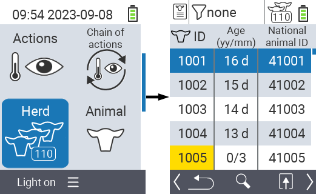
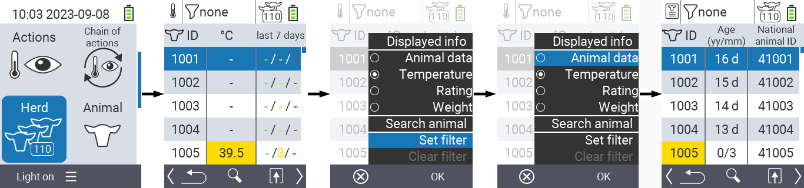
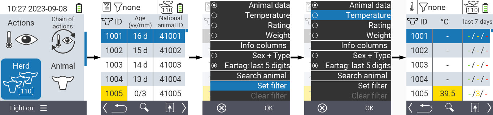
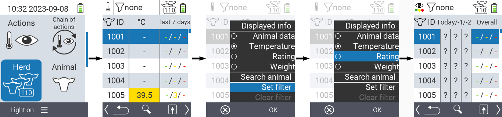
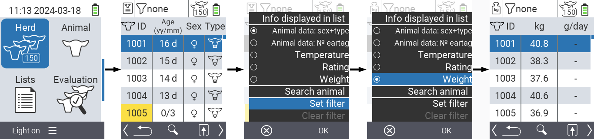
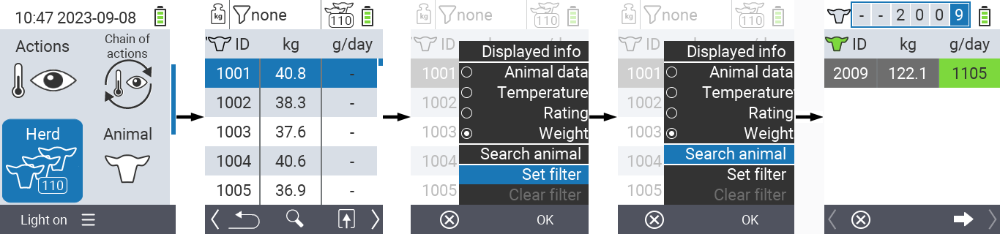
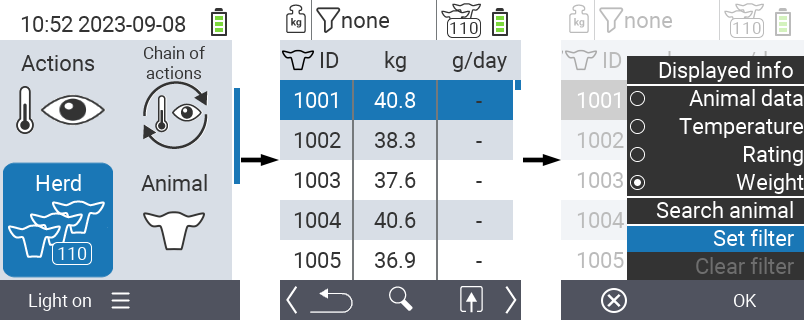
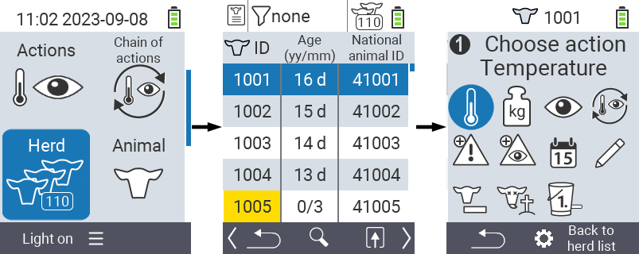

## Herd

Within the Herd menu item, you can view your entire herd, search for individual animals and display important information. You have the following possibilities:

- View [animal data](#view-animal-data)
- View [temperature data](#display-temperature)
- View [rating data](#view-rating)
- View [weight data](#view-rating)
- [Search animal](#search-animal)
- Set [filter](#set-filter)
- Set [columns info](#set-column-information)
- [Actions](#call-action-menu)

### Preparatory steps

1. On the main screen of your VitalControl device, select the menu item  `Herd` and press the `OK` button.

2. Your herd overview opens.

    

### View animal data

1. Complete the preparatory steps.

2. Use the `F3` key &nbsp;&nbsp; to invoke a popup menu that lists the information categories that can be displayed for the herd list. Use the arrow keys △ ▽ to highlight the line `Animal data` and select this category by pressing the central `OK` button or the `F3` key `OK`.

3. Animal data will now be displayed as content of the herd list.

4. Alternatively, you can use the arrow keys ◁ ▷ to switch between the different display options.

    

{}
By default, the animal data is displayed first. Only when you have the weight displayed, for example, do you have to set the display of the animal data again.
{}

### Display temperature

1. Complete the preparatory steps.

2. Use the `F3` key &nbsp;&nbsp; to invoke a popup menu that lists the information categories that can be displayed for the herd list. Use the arrow keys △ ▽ to highlight the line `Temperature` and select this category by pressing the central `OK` button or the `F3` key `OK`.

3. Temperature data will now be displayed as content of the herd list.

4. Alternatively, you can use the arrow keys ◁ ▷ to switch between the different display options.

    

### View rating

1. Complete the preparatory steps.

2. Use the `F3` key &nbsp;&nbsp; to invoke a popup menu that lists the information categories that can be displayed for the herd list. Use the arrow keys △ ▽ to highlight the line `Rating` and select this category by pressing the central `OK` button or the `F3` key `OK`.

3. Rating data will now be displayed as content of the herd list.

4. Alternatively, you can use the arrow keys ◁ ▷ to switch between the different display options.

    

### Display weight

1. Complete the preparatory steps.

2. Use the `F3` key &nbsp;&nbsp; to invoke a popup menu that lists the information categories that can be displayed for the herd list. Use the arrow keys △ ▽ to highlight the line `Weight` and select this category by pressing the central `OK` button or the `F3` key `OK`.

3. Weight data will now be displayed as content of the herd list.

4. Alternatively, you can use the arrow keys ◁ ▷ to switch between the different display options.

    

### Search animal

1. Complete the preparatory steps.

2. Use the `F3` key &nbsp;&nbsp; to invoke a popup menu that lists various options. Use the arrow keys △ ▽ to highlight the function `Search animal` and invoke the search function by pressing the central `OK` key or the `F3` key `OK`. Alternatively, you can use the `On/Off` button  immediately after step one.

3. Use the arrow keys △ ▽ ◁ ▷ to enter the desired animal number and confirm with `OK`.

    

### Set filter

1. Complete the preparatory steps.

2. Use the `F3` key &nbsp;&nbsp; to invoke a popup menu that lists various options. Use the arrow keys △ ▽ to highlight the function `Set filter` and invoke the filter function by pressing the central `OK` key or the `F3` key `OK`.

3. How to apply the filter can be found [here]().

    

### Set column information

{}
The setting option `Info colums` is only available once `Animal data` info category is selected for display!
{}

1. Complete the preparatory steps.

2. Use the `F3` key &nbsp;&nbsp; to invoke a popup menu that allows you to select the displayed info columns. Use the arrow keys △ ▽ to highlight the line `Sex + type` or `Eartag` and confirm your choice by pressing the central `OK` key or the `F3` key `OK`.

3. The selected column information is displayed.

    

### Call action menu

You always have the option to call up the action menu for an animal.

1. Complete the preparatory steps.

2. Select an animal from the list with the arrow keys △ ▽ and confirm with `OK`.

3. The action menu is now open. How to use this can be found [here](../actions).

4. Return to the herd list with the `F3` key.

    
