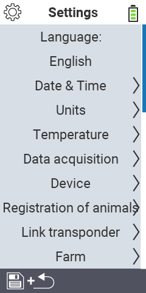

{}
If you click on a menu item, you will be redirected to a description of the respective function.
{}

<map name="workmap">
  <area shape="rect" coords="0,40,240,120" alt="Language" title="Set and permanently store the language of the user interface on your VitalControl device&#10;Mouse klick: open documentation" href="/en/docs/settings/language/">
  <area shape="rect" coords="0,120,240,160" alt="Date & Time" title="Here, you set the date and time&#10;Mouse klick: open documentation" href="/en/docs/settings/datetime/">
  <area shape="rect" coords="0,160,240,200" alt="Units" title="Here you select units for temperature and mass&#10;Mouse klick: open documentation" href="/en/docs/settings/units/">
  <area shape="rect" coords="0,200,240,240" alt="Temperature" title="Set the temperature settings for the application of your VitalControl device&#10;Mouse klick: open documentation" href="/en/docs/settings/temperature/">
   <area shape="rect" coords="0,240,240,280" alt="Data acquisition" title="Here you store relevant information for the animal data collection&#10;Mouse klick: open documentation" href="/en/docs/settings/data-acquisition/">
   <area shape="rect" coords="0,280,240,320" alt="Device" title="Here you can adjust various device settings&#10;Mausklick: zur Dokumentation" href="/en/docs/settings/device/">
   <area shape="rect" coords="0,320,240,360" alt="Registration of animals" title="Here you can adjust several factory-set standards concerning the registration of new animals to the requirements of your farm.&#10;Mouse klick: open documentation" href="/en/docs/settings/animal-registration/">
   <area shape="rect" coords="0,360,240,400" alt="Link transponder" title="Set the assignment of the transponder on your VitalControl device&#10;Mouse klick: open documentation" href="/en/docs/settings/transponder-linkage/">
   <area shape="rect" coords="0,400,240,440" alt="Farm" title="Permanently save your official twelve digit national farm ID on VitalControl device&#10;Mouse klick: open documentation" href="/en/docs/settings/farm-number/">
</map>
