
<a class="btn btn-lg btn-primary me-3 mb-4" href="#td-block-2">
  Aprende más <i class="fas fa-arrow-alt-circle-right ms-2"></i>
</a>
<a class="btn btn-lg btn-secondary me-3 mb-4" href="/es/docs/">
  Documentación<i class="fa-solid fa-book ms-2 "></i>
</a>

¡Gestión de la salud al más alto nivel!




{}

**Reduce** la **papelera**  

**Aumenta** la **salud animal**

Ten **todo** a la **vista**   

Con solo **un dispositivo**     
{}


{}
 

    

    <button type="button" data-bs-target="#carouselLanguageIndicators" data-bs-slide-to="0" class="active" aria-current="true" aria-label="Alemán"></button>
    <button type="button" data-bs-target="#carouselLanguageIndicators" data-bs-slide-to="1" aria-label="Inglés"></button>
    <button type="button" data-bs-target="#carouselLanguageIndicators" data-bs-slide-to="2" aria-label="Holandés"></button>
    <button type="button" data-bs-target="#carouselLanguageIndicators" data-bs-slide-to="3" aria-label="Finés"></button>
    <button type="button" data-bs-target="#carouselLanguageIndicators" data-bs-slide-to="4" aria-label="Francés"></button>
    <button type="button" data-bs-target="#carouselLanguageIndicators" data-bs-slide-to="5" aria-label="Ruso"></button>
    <button type="button" data-bs-target="#carouselLanguageIndicators" data-bs-slide-to="6" aria-label="Español"></button>
    <button type="button" data-bs-target="#carouselLanguageIndicators" data-bs-slide-to="7" aria-label="Bosnio"></button>
    <button type="button" data-bs-target="#carouselLanguageIndicators" data-bs-slide-to="8" aria-label="Búlgaro"></button>
    <button type="button" data-bs-target="#carouselLanguageIndicators" data-bs-slide-to="9" aria-label="Chino"></button>
    <button type="button" data-bs-target="#carouselLanguageIndicators" data-bs-slide-to="10" aria-label="Checo"></button>
    <button type="button" data-bs-target="#carouselLanguageIndicators" data-bs-slide-to="11" aria-label="Noruego"></button>
    <button type="button" data-bs-target="#carouselLanguageIndicators" data-bs-slide-to="12" aria-label="Griego"></button>
    <button type="button" data-bs-target="#carouselLanguageIndicators" data-bs-slide-to="13" aria-label="Turco"></button>
    <button type="button" data-bs-target="#carouselLanguageIndicators" data-bs-slide-to="14" aria-label="Ucraniano"></button>
    <button type="button" data-bs-target="#carouselLanguageIndicators" data-bs-slide-to="15" aria-label="Estonio"></button>
    
 

    

      

        <h3>Alemán</h3>
      

      
    

    

      

        <h3>Holandés</h3>
      

      
    

    

      

        <h3>Inglés</h3>
      

      
    

    

      

        <h3>Finés</h3>
      

      
    

    

      

        <h3>Francés</h3>
      

      
    

    

      

        <h3>Ruso</h3>
      

    
    
  
    

      

        <h3>Español</h3>
      

    
    

      

        

          <h3>Bosnio</h3>
        

      
      

      

        

          <h3>Búlgaro</h3>
        

      
      

      

        

          <h3>Chino</h3>
        

      
      

      

        

          <h3>Checo</h3>
        

      
      

      

        

          <h3>Noruego</h3>
        

      
      

      

        

          <h3>Griego</h3>
        

      
      
      
      

        

          <h3>Turco</h3>
        

      
      
 
      

        

          <h3>Ucraniano</h3>
        

      
      
 
      

        

          <h3>Estonio</h3>
        

      
      
 
  

  <button class="carousel-control-prev" type="button" data-bs-target="#carouselLanguagesAutoplaying" data-bs-slide="prev" style="left: 0px; top: 37px; height: 320px;">
    
    Anterior
  </button>
  <button class="carousel-control-next" type="button" data-bs-target="#carouselLanguagesAutoplaying" data-bs-slide="next" style="right: 0px; top: 37px; height: 320px;">
    
    Siguiente
  </button>

{}

{}
 

    

    <button type="button" data-bs-target="#carouselActionsIndicators" data-bs-slide-to="0" class="active" aria-current="true" aria-label="Temperatura"></button>
    <button type="button" data-bs-target="#carouselActionsIndicators" data-bs-slide-to="1" aria-label="Pesaje"></button>
    <button type="button" data-bs-target="#carouselActionsIndicators" data-bs-slide-to="2" aria-label="Calificación"></button>
    <button type="button" data-bs-target="#carouselActionsIndicators" data-bs-slide-to="3" aria-label="Cadena de acciones"></button>
    <button type="button" data-bs-target="#carouselActionsIndicators" data-bs-slide-to="4" aria-label="Alarma"></button>
    <button type="button" data-bs-target="#carouselActionsIndicators" data-bs-slide-to="5" aria-label="En vigilancia"></button>
    <button type="button" data-bs-target="#carouselActionsIndicators" data-bs-slide-to="6" aria-label="Historial del animal"></button>
    <button type="button" data-bs-target="#carouselActionsIndicators" data-bs-slide-to="7" aria-label="Editar"></button>
    <button type="button" data-bs-target="#carouselActionsIndicators" data-bs-slide-to="8" aria-label="Desregistrar"></button>
    <button type="button" data-bs-target="#carouselActionsIndicators" data-bs-slide-to="9" aria-label="Pérdida del animal"></button>
    <button type="button" data-bs-target="#carouselActionsIndicators" data-bs-slide-to="10" aria-label="Vincular transpondedor"></button>
    <button type="button" data-bs-target="#carouselActionsIndicators" data-bs-slide-to="11" aria-label="Desvincular transpondedor"></button>
    <button type="button" data-bs-target="#carouselActionsIndicators" data-bs-slide-to="12" aria-label="Vincular ID del animal"></button>
    <button type="button" data-bs-target="#carouselActionsIndicators" data-bs-slide-to="13" aria-label="Vincular ID electrónico del animal"></button>
  

    

      

        <h3>Temperatura</h3>
      

      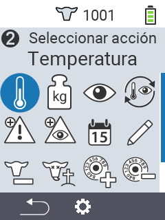
    

    

      

        <h3>Pesaje</h3>
      

      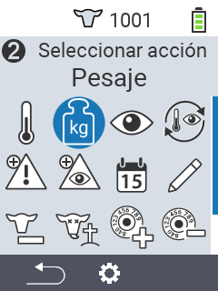
    

    

      

        <h3>Calificación</h3>
      

      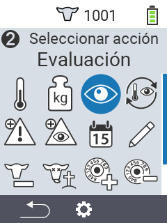
    

    

      

        <h3>Cadena de acciones</h3>
      

      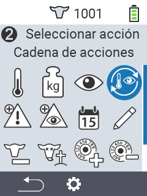
    

    

      

        <h3>Alarma</h3>
      

      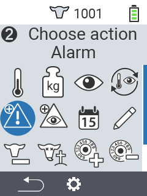
    

    

      

        <h3>En vigilancia</h3>
      

      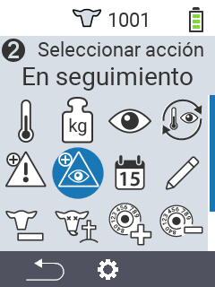
    

    

      

        <h3>Historial del animal</h3>
      

      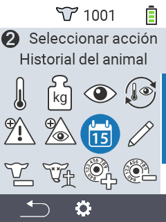
    

    

      

        <h3>Editar</h3>
      

      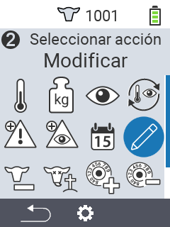
    

    

      

        <h3>Desregistrar</h3>
      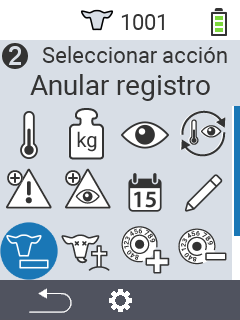
      

    

    

      

        <h3>Pérdida del animal</h3>
      

      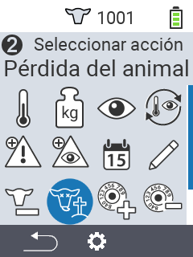
    

    

      

        <h3>Vincular transpondedor</h3>
      

      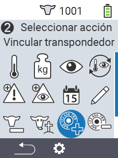
    

    

      

        <h3>Desvincular transpondedor</h3>
      

      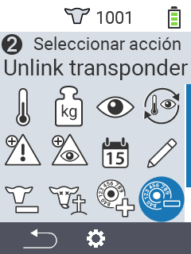
    
      
    

      

        <h3>Vincular ID del animal</h3>
      

      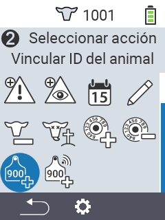
    
   
    

      

        <h3>Vincular ID del animal</h3>
      

      
    
             
  

  <button class="carousel-control-prev" type="button" data-bs-target="#carouselActionsAutoplaying" data-bs-slide="prev" style="left: 0px; top: 37px; height: 320px;">
    
    Anterior
  </button>
  <button class="carousel-control-next" type="button" data-bs-target="#carouselActionsAutoplaying" data-bs-slide="next" style="right: 0px; top: 37px; height: 320px;">
    
    Siguiente
  </button>

{}

{}
 

    

    <button type="button" data-bs-target="#carouselListsIndicators" data-bs-slide-to="0" class="active" aria-current="true" aria-label="Alarma"></button>
    <button type="button" data-bs-target="#carouselListsIndicators" data-bs-slide-to="1" aria-label="En observación"></button>
    <button type="button" data-bs-target="#carouselListsIndicators" data-bs-slide-to="2" aria-label="Acción"></button>
    <button type="button" data-bs-target="#carouselListsIndicators" data-bs-slide-to="3" aria-label="Vacas frescas"></button>
    <button type="button" data-bs-target="#carouselListsIndicators" data-bs-slide-to="4" aria-label="Vacas secas"></button>
  

    

      

        <h3>Alarma</h3>
      

      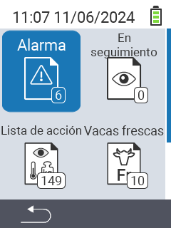
    

    

      

        <h3>En observación</h3>
      

      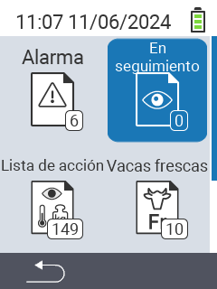
    

    

      

        <h3>Lista de acción</h3>
      
      
      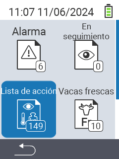
    

    

      

        <h3>Vacas frescas</h3>
      

      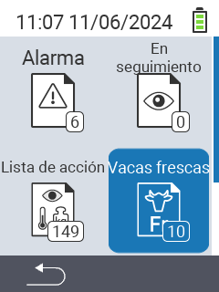
    

    

      

        <h3>Vacas secas</h3>
      

    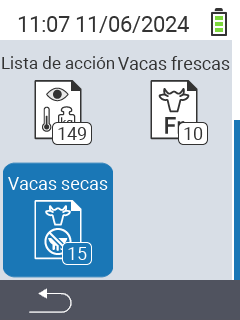
    

  

  <button class="carousel-control-prev" type="button" data-bs-target="#carouselListsAutoplaying" data-bs-slide="prev" style="left: 0px; top: 37px; height: 320px;">
    
    Anterior
  </button>
  <button class="carousel-control-next" type="button" data-bs-target="#carouselListsAutoplaying" data-bs-slide="next" style="right: 0px; top: 37px; height: 320px;">
    
    Siguiente
  </button>

{}

{}
 

    

    <button type="button" data-bs-target="#carouselListsIndicators" data-bs-slide-to="0" class="active" aria-current="true" aria-label="Peso de la evaluación"></button>
    <button type="button" data-bs-target="#carouselListsIndicators" data-bs-slide-to="1" aria-label="Temperatura de la evaluación"></button>
    <button type="button" data-bs-target="#carouselListsIndicators" data-bs-slide-to="2" aria-label="Calificación de la evaluación"></button>
    <button type="button" data-bs-target="#carouselListsIndicators" data-bs-slide-to="3" aria-label="Mortalidad de la evaluación"></button>
  

    

      

        <h3>Peso</h3>
      
 
      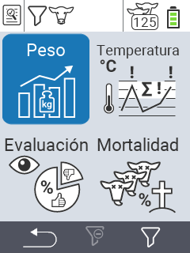
    

    

      

        <h3>Temperatura</h3>
      
 
      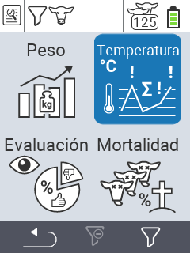
    

    

      

        <h3>Calificación</h3>
      
 
      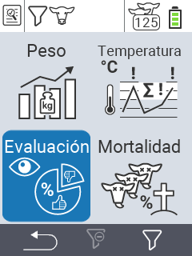
    

    

      

        <h3>Mortalidad</h3>
      
 
      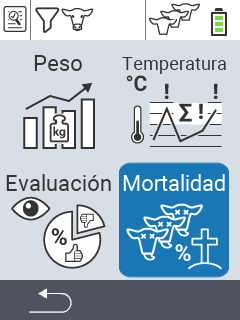
    

  

  <button class="carousel-control-prev" type="button" data-bs-target="#carouselEvaluationAutoplaying" data-bs-slide="prev" style="left: 0px; top: 37px; height: 320px;">
    
    Anterior
  </button>
  <button class="carousel-control-next" type="button" data-bs-target="#carouselEvaluationAutoplaying" data-bs-slide="next" style="right: 0px; top: 37px; height: 320px;">
    
    Siguiente
  </button>

{}


{}

Adecuado para **varios tipos de animales** en diferentes **edades**

{}


{}
 

 
{}

{}
 

 
{}

{}
 

 
{}



{}

Nuestros **puntos destacados** para ti

{}


{}
 
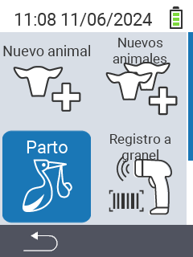
 
{}

{}
 
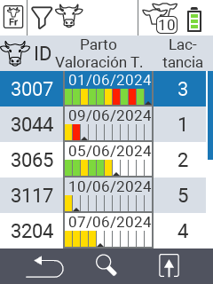
 
{}

{}
 
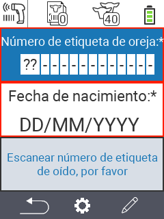
 
{}

{}
 

 
{}



{}
Urban en redes sociales

{}

{}

{}
{}

{}
{}

{}
{}

{}
{}


