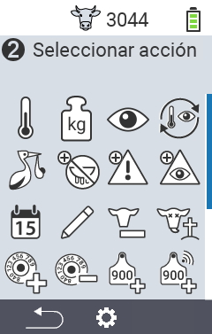
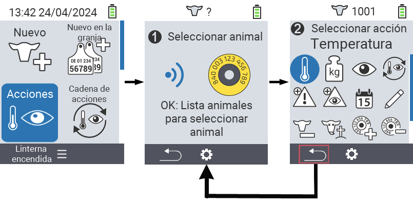
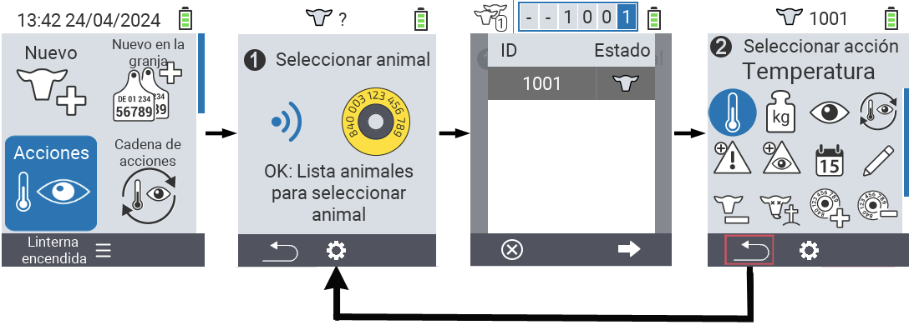

## Acciones disponibles

Dependiendo del tipo de animal, puedes realizar hasta 16 acciones diferentes para un animal.

<map name="workmap">
  <area shape="rect" coords="3,100,60,165" alt="Temperatura" title="Medir la fiebre en tus animales&#10;Clic del ratón: abrir documentación" href="/es/docs/actions/measure-temperature/">
  <area shape="rect" coords="60,100,118,165" alt="Pesaje" title="Registrar el peso de tus animales&#10;Clic del ratón: abrir documentación" href="/es/docs/actions/record-weight/">
  <area shape="rect" coords="118,100,174,165" alt="Calificación" title="Calificar tus animales&#10;Clic del ratón: abrir documentación" href="/es/docs/actions/rating/">
  <area shape="rect" coords="174,100,230,165" alt="Cadena de acciones" title="Aplicar y configurar la cadena de acción&#10;Clic del ratón: abrir documentación" href="/es/docs/chain-of-actions/">
   <area shape="rect" coords="3,165,60,225" alt="Parto" title="Registrar un parto&#10;Clic del ratón: abrir documentación" href="/es/docs/actions/calving/">
   <area shape="rect" coords="60,165,120,225" alt="Secado" title="Secar una vaca o añadirla a la lista de vacas frescas&#10;Clic del ratón: abrir documentación" href="/es/docs/actions/dry-off/">
   <area shape="rect" coords="120,165,175,225" alt="Alarma" title="Añadir y quitar animales de la lista de alarmas&#10;Clic del ratón: abrir documentación" href="/es/docs/actions/alarm/">
   <area shape="rect" coords="175,165,230,225" alt="En observación" title="Poner animales en la lista de en observación o quitarlos&#10;Clic del ratón: abrir documentación" href="/es/docs/actions/on-watch/">
   <area shape="rect" coords="3,225,60,280" alt="Historial del animal" title="Ver el historial de un animal&#10;Clic del ratón: abrir documentación" href="/es/docs/actions/animal-history/">
   <area shape="rect" coords="60,225,120,280" alt="Editar" title="Editar datos del animal seleccionado&#10;Clic del ratón: abrir documentación" href="/es/docs/actions/edit/">
   <area shape="rect" coords="120,225,175,280" alt="Dar de baja" title="Dar de baja a un animal&#10;Clic del ratón: abrir documentación" href="/es/docs/actions/unregister/">
   <area shape="rect" coords="175,225,230,280" alt="Pérdida del animal" title="Registrar una pérdida del animal&#10;Clic del ratón: abrir documentación" href="/es/docs/actions/animal-loss/">
   <area shape="rect" coords="3,280,60,337" alt="Vincular transpondedor" title="Asignar un transpondedor a un animal&#10;Clic del ratón: abrir documentación" href="/es/docs/actions/link-transponder/">
   <area shape="rect" coords="55,280,120,337" alt="Desvincular transpondedor" title="Eliminar el vínculo del transpondedor con un animal&#10;Clic del ratón: abrir documentación" href="/es/docs/actions/unlink-transponder/">
   <area shape="rect" coords="120,280,175,337" alt="Vincular ID del animal manualmente" title="Asignar un ID nacional de animal a un animal que no tiene un ID nacional de animal&#10;Clic del ratón: abrir documentación" href="/es/docs/actions/link-animal-id/#link-animal-id">
   <area shape="rect" coords="175,280,230,337" alt="Vincular ID del animal con escaneo" title="Asignar un ID nacional de animal a un animal que no tiene un ID nacional de animal&#10;Clic del ratón: abrir documentación" href="/es/docs/actions/link-animal-id/#link-animal-id-with-electronic-ear-tag-scan">

<area shape="rect" coords="100,340,140,375" alt="Configuración" title="Acceder a la configuración&#10;Clic del ratón: a la documentación" href="/es/docs/actions/setting/">
</map>

{}
Cada acción está identificada por un símbolo. Mueva el puntero del ratón sobre un símbolo en la gráfica de abajo y déjelo quieto por un momento. Aparecerá una descripción emergente, presentando información sobre la acción respectiva. Si hace clic en uno de los símbolos, será redirigido a una descripción de la acción correspondiente.
{}

## Procedimiento general

Dentro del menú  `Acciones` puedes seleccionar el siguiente animal en cualquier momento sin tener que salir del ítem del menú Acciones. Para seleccionar el siguiente animal, proceda de la siguiente manera:

1. Seleccione el ítem del menú  `Acciones` en la pantalla principal de su dispositivo VitalControl y presione el botón `OK`.

2. Escanee un animal usando el transpondedor o seleccione un animal de la lista. Confirme presionando `OK` y seleccione un animal usando los botones de flecha △ ▽. Confirme con `OK`.

3. Se abre un submenú en el que encontrará iconos para numerosas acciones de animales. Use los botones de flecha para seleccionar la acción deseada e inicie la acción presionando el botón `OK`. Dependiendo de la acción seleccionada, aparecerán una o más pantallas o una ventana emergente.

4. Si lo desea, ahora puede seleccionar y ejecutar otra acción para el animal actual.

5. Después de haber realizado la(s) acción(es) deseada(s) para el animal, regrese al paso 2 'Selección de animal'. Para hacer esto, presione el botón izquierdo `F1` debajo del símbolo `Back` en la esquina inferior izquierda del pie de página.

6. La ventana del paso dos se abrirá automáticamente de nuevo y puede seleccionar el siguiente animal o volver al menú principal presionando el botón `F1` debajo del símbolo `Back`.



{}

{}
{}

{}

