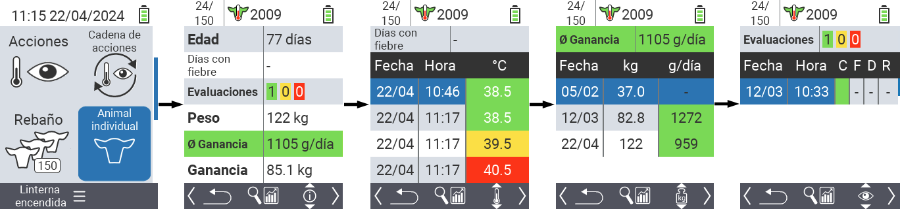
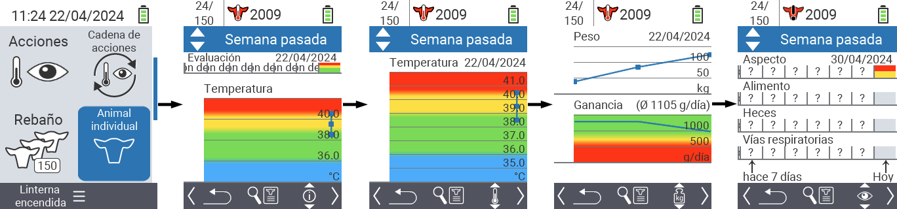
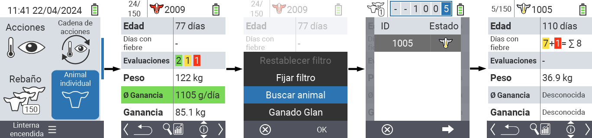
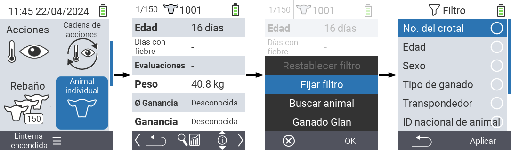

## Animal

La función de animal individual le permite ver información importante sobre el peso, la temperatura y la calificación de cada animal individual. Siempre tiene la opción de mostrar la información como un gráfico o como una lista. Para usar la función de animal individual, proceda de la siguiente manera:

1. En la pantalla principal de su dispositivo VitalControl, seleccione el elemento del menú  `Animal individual` y presione el botón `OK`.

2. Se abre una visión general de la información más importante del animal. El borde superior de la pantalla le muestra qué animal está viendo actualmente. Use la tecla `F3` para elegir entre información del animal , temperatura , peso   y calificación .

{}
Dentro de cada visualización de información tiene la opción de [buscar un animal](#buscar-animal), establecer un [filtro](#establecer-filtro) y cambiar a una [vista gráfica](#establecer-vista-gráfica).
También puede cambiar entre los animales individuales en cualquier momento usando las teclas de flecha ◁ ▷.
{}

### Establecer vista gráfica

1. Presione el botón superior medio `On/Off`  para abrir un menú emergente. En este menú, puede elegir entre las funciones `Fijar filtro`, `Buscar animal` o `Ganado Glan`.

2. Seleccione `Vista gráfica` con las teclas de flecha △ ▽ y confirme con `OK`.

### Buscar animal

1. Presiona el botón superior central `On/Off`  para abrir un menú emergente. En este menú, puedes elegir entre las funciones `Fijar filtro`, `Buscar animal` o `Ganado Glan`.

2. Selecciona `Buscar animal` con las teclas de flecha △ ▽ y confirma con `OK`.

3. Usa las teclas de flecha △ ▽ ◁ ▷ para seleccionar el número de animal deseado y confirma con `OK`

### Establecer filtro

1. Presiona el botón superior central `On/Off`  para abrir un menú emergente. En este menú, puedes elegir entre las funciones `Fijar filtro`, `Buscar animal` o `Ganado Glan`.

2. Selecciona `Establecer filtro` con las teclas de flecha △ ▽ y confirma con `OK`.
Puedes obtener instrucciones sobre cómo usar el filtro [aquí]().

