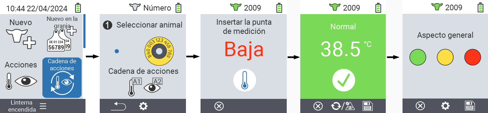
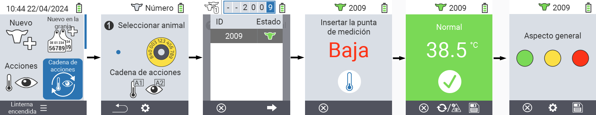
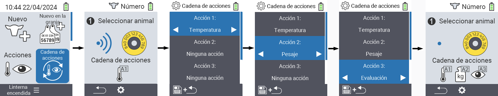

## Cadena de acciones {#chain-of-actions}
 
La cadena de acciones te permite llevar a cabo automáticamente varias acciones para un animal una tras otra. Por ejemplo, puedes seleccionar las acciones `` y ``. Si luego realizas la cadena de acciones, puedes tomar primero la temperatura de tu animal y registrar la calificación inmediatamente después.

### Usar cadena de acciones {#use-chain-of-actions}

1. En la pantalla principal de tu dispositivo VitalControl, selecciona el ítem del menú &nbsp;&nbsp; `` y presiona el botón ``.

2. Escanea un animal usando el transpondedor o confirma con `` y usa las teclas de flecha △ ▽ ◁ ▷ para ingresar la ID del animal deseado.

3. La cadena de acciones ahora se ejecuta. Tan pronto como todas las acciones en la cadena de acciones se hayan llevado a cabo, se puede seleccionar directamente el siguiente animal.



{}

{}
{}

{}


### Configurar cadena de acciones {#set-chain-of-actions}

1. En la pantalla principal de tu dispositivo VitalControl, selecciona el ítem del menú &nbsp;&nbsp; `` y presiona el botón ``.

2. Usa el botón `F2` &nbsp;&nbsp; (``).

3. Aparece una pantalla superpuesta. Usa las teclas de flecha △ ▽ para elegir entre las acciones listadas del 1 al 4 (puedes realizar hasta cuatro acciones en fila). Usa las teclas de flecha ◁ ▷ para seleccionar la acción deseada para la respectiva acción. Guarda la configuración con la tecla `F1` &nbsp;&nbsp;.

4. Si desea restablecer toda la cadena de acciones, seleccione la opción `` en el submenú utilizando las teclas de flecha △ ▽ y confirme con ``.

    

{}
Dentro de las acciones individuales, tiene las mismas opciones de configuración que se describen en el capítulo [Acciones](../actions) para cada acción individual.
{}

{}
Los símbolos en la pantalla de inicio de la cadena de acciones muestran qué acciones ha configurado y en qué orden.
{}
