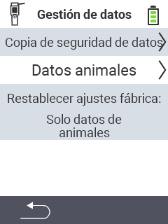

{}
Si haces clic en un elemento del menú, serás redirigido a una descripción de la función respectiva.
{}

<map name="workmap">
  <area shape="rect" coords="2,40,238,80" alt="Copia de datos" title="Las instrucciones para crear una copia de seguridad se pueden encontrar aquí&#10;Clic del ratón: abrir documentación" href="/es/docs/device/data-management/data-backup/">

  <area shape="rect" coords="2,80,238,120" alt="Datos del animal" title="Las instrucciones para restaurar una copia de seguridad se pueden encontrar aquí&#10;Clic del ratón: abrir documentación" href="/es/docs/device/data-management/animal-data/">

  <area shape="rect" coords="2,120,238,200" alt="Restablecimiento de fábrica" title="Toda la información e instrucciones para restablecer el dispositivo y los datos del animal se pueden encontrar aquí&#10;Clic del ratón: abrir documentación" href="/es/docs/reset/">

  <area shape="rect" coords="2,282,120,319" alt="Atrás" title="Toda la información e instrucciones para exportar datos del animal se pueden encontrar aquí&#10;Clic del ratón: abrir documentación" href="/es/docs/device/">
</map>
