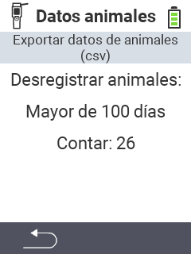

<map name="workmap">
  <area shape="rect" coords="2,40,238,80" alt="Exportar datos de animales (csv)" title="Exporta tus datos de animales&#10;Clic del ratón: abrir documentación" href="/es/docs/data-export/usb-drive/">

  <area shape="rect" coords="2,80,238,200" alt="Desregistrar animales" title="Especifica la edad desde la cual los animales deben ser desregistrados&#10;Clic del ratón: abrir documentación" href="/es/docs/device/data-management/animal-data/unregister-animal/">

  <area shape="rect" coords="2,282,120,319" alt="Atrás" title="Aquí puedes encontrar toda la información e instrucciones para exportar datos de animales&#10;Clic del ratón: abrir documentación" href="/es/docs/device/data-management/">
</map>
