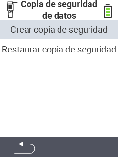

<map name="workmap">
  <area shape="rect" coords="2,40,238,80" alt="Crear respaldo" title="Las instrucciones para crear un respaldo se pueden encontrar aquí&#10;Clic del ratón: abrir documentación" href="/es/docs/backup/backup/">

  <area shape="rect" coords="2,80,238,120" alt="Restaurar respaldo" title="Las instrucciones para restaurar un respaldo se pueden encontrar aquí&#10;Clic del ratón: abrir documentación" href="/es/docs/backup/restore/">

  <area shape="rect" coords="2,282,120,319" alt="Atrás" title="Retroceder un nivel&#10;Clic del ratón: abrir documentación" href="/es/docs/device/data-management/">
</map>
