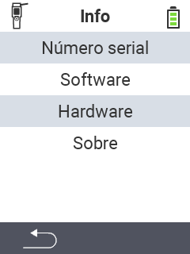

{}
Si haces clic en un elemento del menú, serás redirigido a una descripción de la función respectiva.
{}

<map name="workmap">
  <area shape="rect" coords="2,40,238,80" alt="Número de serie" title="Para recuperar el número de serie de tu dispositivo haz clic aquí&#10;Mausklick: zur Dokumentation" href="/es/docs/device/info/serial-number/">
  <area shape="rect" coords="2,80,238,120" alt="Software" title="Las instrucciones para ver tu versión de software se pueden encontrar aquí&#10;Mausklick: zur Dokumentation" href="/es/docs/firmware/versions/">
  <area shape="rect" coords="2,120,238,160" alt="Hardware" title="Para acceder a la información del hardware de tu dispositivo haz clic aquí&#10;Mausklick: zur Dokumentation" href="/es/docs/device/info/hardware/">
  <area shape="rect" coords="2,160,238,200" alt="Acerca de" title="Consulta la información del proveedor&#10;Mausklick: zur Dokumentation" href="/es/docs/device/info/about/">

  <area shape="rect" coords="2,282,120,319" alt="Atrás" title="Retrocede un nivel&#10;Mouse click: open documentation" href="/es/docs/device/">
</map>
