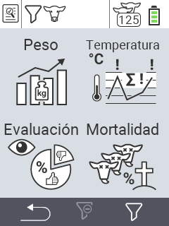

{}
Si haces clic en un elemento del menú, serás redirigido a una descripción de la función respectiva.
{}

<map name="workmap">
  <area shape="rect" coords="3,40,116,160" alt="Peso" title="Evalúa tus datos almacenados en la sección de Peso&#10;Clic del ratón: abrir documentación" href="/es/docs/evaluation/weight/">
  <area shape="rect" coords="3,160,116,279" alt="Calificación" title="Evalúa tus datos almacenados en la sección de calificación&#10;Clic del ratón: abrir documentación" href="/es/docs/evaluation/rating/">

  <area shape="rect" coords="116,40,238,160" alt="Temperatura" title="Evalúa tus datos almacenados en la sección de Temperatura&#10;Clic del ratón: abrir documentación" href="/es/docs/evaluation/temperature/">
  <area shape="rect" coords="116,160,238,279" alt="Mortalidad" title="Evalúa tus datos almacenados en la sección de mortalidad&#10;Clic del ratón: abrir documentación" href="/es/docs/evaluation/mortality/">

  <area shape="rect" coords="150,282,238,319" alt="Filtro" title="Establece un filtro&#10;Clic del ratón: a la documentación" href="/es/docs/filter">
  <area shape="rect" coords="2,282,95,319" alt="Atrás" title="Retrocede un nivel&#10;Clic del ratón: a la documentación" href="/es/docs/menu/mainmenu/">
</map>
