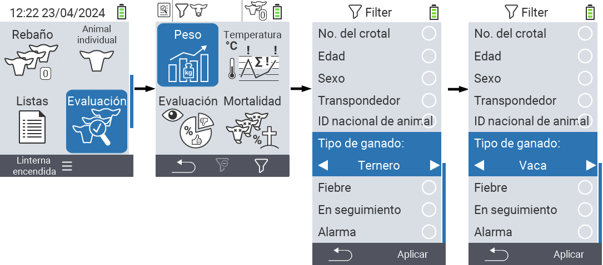
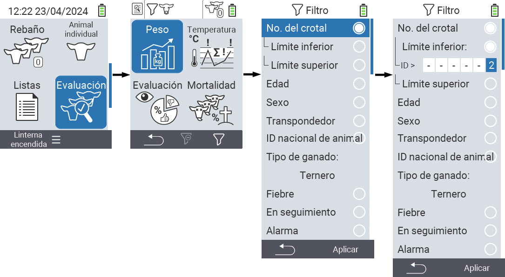
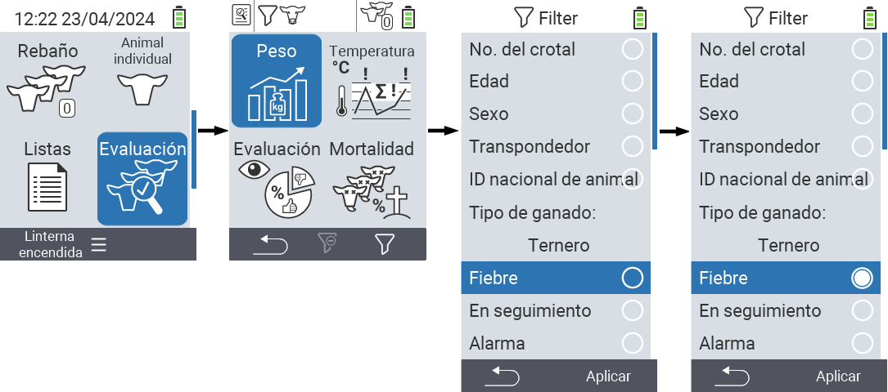

## Aplicando filtros {#applying-filters}

{}
El filtro te ayuda a realizar una selección usando criterios de filtro dentro de los elementos del menú ``, `` y `` del dispositivo VitalControl. Tan pronto como apliques un filtro, aparecerán símbolos para los diversos criterios de filtro en la parte superior de la pantalla. Estos símbolos se utilizan para ayudarte a saber si se activaron criterios de filtro y cuáles. Por ejemplo, si configuras el filtro `` a masculino, el dispositivo solo usará animales machos. Por ejemplo, si también activas el filtro ``, el dispositivo solo usará animales machos que están en la lista de observación.
{}

Para crear un filtro en las evaluaciones, procede de la siguiente manera:

1. En el submenú perteneciente al elemento del menú superior  `` presiona la tecla `F3`  una vez. Dentro del submenú perteneciente a los elementos del menú superior  `` y  ``, tienes que presionar la tecla dos veces.

2. Se abre un submenú en el que puedes configurar todas las opciones de filtro. Puedes filtrar por ``, ``, ``, ``, ``, ``, ``, `` y ``.

3. Para los filtros ``, ``, `` y `` navega hasta el área correspondiente y confirma con ``. Usa las teclas de flecha ◁ ▷ para especificar la configuración deseada. Usa la tecla `F3` `` para poner en marcha la configuración seleccionada. Para descartar los cambios en el filtro, presiona la tecla `F1` &nbsp;&nbsp;.

4. Para los filtros `` y `` selecciona el criterio correspondiente y confirma con ``. Ahora se te mostrarán un límite inferior y superior. Navega hasta el límite deseado usando las teclas de flecha △ ▽ y confirma presionando `` dos veces. Ahora puedes establecer el número deseado usando las teclas de flecha ◁ ▷ y las teclas de flecha △ ▽. Una vez que todos los ajustes sean correctos, presiona `` nuevamente para salir del modo de configuración y aplicar el(los) filtro(s) seleccionado(s) con la tecla `F3` ``. Usando la tecla `F1` &nbsp;&nbsp;, puedes descartar tus cambios si lo deseas.

5. Para los filtros ``, `` y `` hay una posibilidad de deshabilitar o habilitar su aplicación. Para hacer esto, selecciona el filtro correspondiente y confirma con ``. El filtro ahora está activo. Confirma de nuevo con `` para desactivar el filtro.

6. Una vez que hayas configurado todos los filtros, usa la tecla `F3` `` para poner en marcha los filtros definidos o presiona la tecla `F1`  para descartar tus cambios en el(los) filtro(s).
