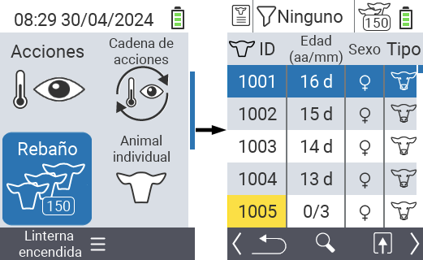
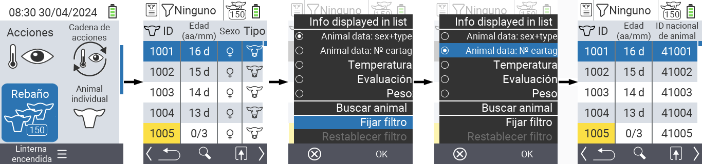
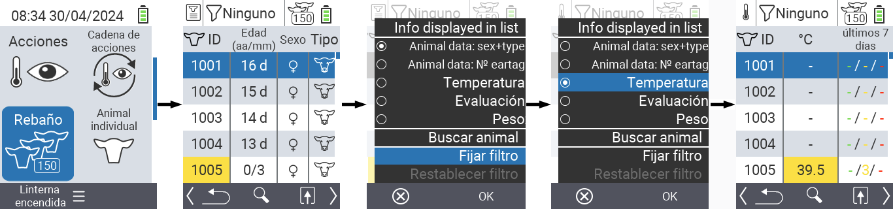
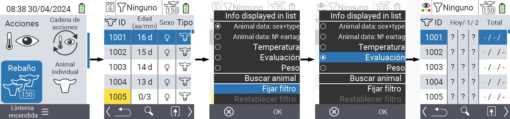
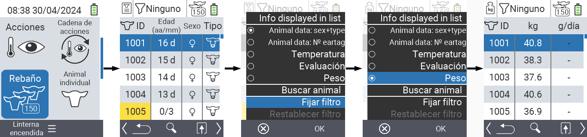
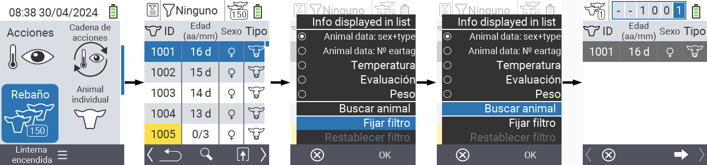
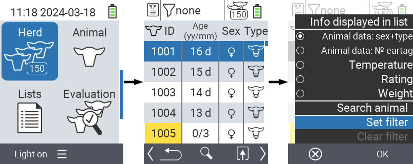
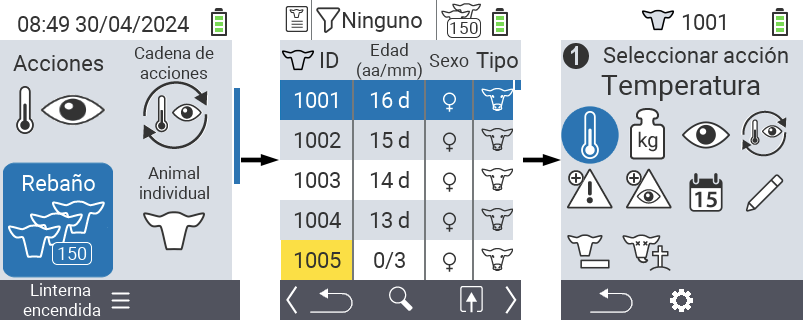

## Rebaño

Dentro del ítem del menú Rebaño, puedes ver todo tu rebaño, buscar animales individuales y mostrar información importante. Tienes las siguientes posibilidades:

- Ver [datos del animal](#view-animal-data)
- Ver [datos de temperatura](#display-temperature)
- Ver [datos de calificación](#view-rating)
- Ver [datos de peso](#view-rating)
- [Buscar animal](#search-animal)
- Establecer [filtro](#set-filter)
- [Acciones](#call-action-menu)

### Pasos preparatorios

1. En la pantalla principal de tu dispositivo VitalControl, selecciona el ítem del menú  `Rebaño` y presiona el botón `OK`.

2. Se abrirá tu vista general del rebaño.

    

### Ver datos del animal

1. Completa los pasos preparatorios.

2. Usa la tecla `F3` &nbsp;&nbsp; para invocar un menú emergente que lista las categorías de información que pueden mostrarse para la lista del rebaño. Usa las teclas de flecha △ ▽ para resaltar la línea `Datos del animal: sexo + tipo` o `Datos del animal: N0 etiqueta de oreja` y selecciona esta categoría presionando el botón central `OK` o la tecla `F3` `OK`. Las dos opciones de selección difieren en la visualización de la barra de información.

3. Los datos del animal ahora se mostrarán como contenido de la lista del rebaño.

4. Alternativamente, puedes usar las teclas de flecha ◁ ▷ para cambiar entre las diferentes opciones de visualización.

    

{}
Por defecto, los datos del animal se muestran primero. Solo cuando tienes el peso mostrado, por ejemplo, tienes que configurar nuevamente la visualización de los datos del animal.
{}

### Mostrar temperatura

1. Completa los pasos preparatorios.

2. Utiliza la tecla `F3` &nbsp;&nbsp; para invocar un menú emergente que lista las categorías de información que se pueden mostrar para la lista del rebaño. Usa las teclas de flecha △ ▽ para resaltar la línea `Temperatura` y selecciona esta categoría presionando el botón central `OK` o la tecla `F3` `OK`.

3. Los datos de temperatura ahora se mostrarán como contenido de la lista del rebaño.

4. Alternativamente, puedes usar las teclas de flecha ◁ ▷ para cambiar entre las diferentes opciones de visualización.

    

### Ver calificación

1. Completa los pasos preparatorios.

2. Utiliza la tecla `F3` &nbsp;&nbsp; para invocar un menú emergente que lista las categorías de información que se pueden mostrar para la lista del rebaño. Usa las teclas de flecha △ ▽ para resaltar la línea `Calificación` y selecciona esta categoría presionando el botón central `OK` o la tecla `F3` `OK`.

3. Los datos de calificación ahora se mostrarán como contenido de la lista del rebaño.

4. Alternativamente, puedes usar las teclas de flecha ◁ ▷ para cambiar entre las diferentes opciones de visualización.

    

### Mostrar peso

1. Completa los pasos preparatorios.

2. Utiliza la tecla `F3` &nbsp;&nbsp; para invocar un menú emergente que lista las categorías de información que se pueden mostrar para la lista del rebaño. Usa las teclas de flecha △ ▽ para resaltar la línea `Peso` y selecciona esta categoría presionando el botón central `OK` o la tecla `F3` `OK`.

3. Los datos de peso ahora se mostrarán como contenido de la lista del rebaño.

4. Alternativamente, puedes usar las teclas de flecha ◁ ▷ para cambiar entre las diferentes opciones de visualización.

    

### Buscar animal

1. Completa los pasos preparatorios.

2. Utiliza la tecla `F3` &nbsp;&nbsp; para invocar un menú emergente que lista varias opciones. Usa las teclas de flecha △ ▽ para resaltar la función `Buscar animal` e invoca la función de búsqueda presionando la tecla central `OK` o la tecla `F3` `OK`. Alternativamente, puedes usar el botón `On/Off`  inmediatamente después del primer paso.

3. Utiliza las teclas de flecha △ ▽ ◁ ▷ para ingresar el número del animal deseado y confirma con `OK`.

    

### Establecer filtro

1. Completa los pasos preparatorios.

2. Utiliza la tecla `F3` &nbsp;&nbsp; para invocar un menú emergente que lista varias opciones. Usa las teclas de flecha △ ▽ para resaltar la función `Establecer filtro` e invoca la función de filtro presionando la tecla central `OK` o la tecla `F3` `OK`.

3. Cómo aplicar el filtro se puede encontrar [aquí]().

    

### Llamar al menú de acciones

Siempre tienes la opción de llamar al menú de acciones para un animal.

1. Completa los pasos preparatorios.

2. Selecciona un animal de la lista con las teclas de flecha △ ▽ y confirma con `OK`.

3. El menú de acciones ahora está abierto. Cómo usar esto se puede encontrar [aquí](../actions).

4. Regresa a la lista del hato con la tecla `F3`.

    
