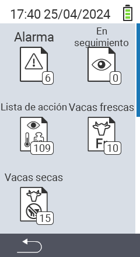

{}
Si haces clic en un elemento del menú, serás redirigido a una descripción de la función respectiva.
{}

<map name="workmap">
  <area shape="rect" coords="3,40,116,160" alt="Lista de alarmas" title="Consulta tu lista de alarmas&#10;Clic del ratón: abrir documentación" href="/es/docs/lists/alarm/">
  <area shape="rect" coords="3,160,116,280" alt="Lista de acciones" title="Consulta tu lista de acciones.&#10;Clic del ratón: abrir documentación" href="/es/docs/lists/actions/">
  <area shape="rect" coords="3,280,116,399" alt="Lista de vacas secas" title="Consulta tu lista de vacas secas&#10;Clic del ratón: abrir documentación" href="/es/docs/lists/dry-cows/">

  <area shape="rect" coords="116,40,230,160" alt="Lista de vigilancia" title="Consulta tu lista de vigilancia&#10;Clic del ratón: abrir documentación" href="/es/docs/lists/on-watch/">
  <area shape="rect" coords="116,160,230,280" alt="Vacas frescas" title="Consulta tu lista de vacas frescas&#10;Clic del ratón: abrir documentación" href="/es/docs/lists/fresh-cows/">

  <area shape="rect" coords="2,401,115,438" alt="Atrás" title="Retroceder un nivel" href="/es/docs/menu/mainmenu/">
</map>

