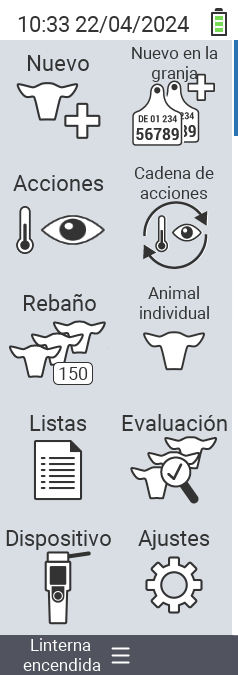

{}
Si haces clic en un elemento del menú, serás redirigido a una descripción de la respectiva función.
{}

<map name="workmap">
  <area shape="rect" coords="3,40,116,160" alt="Nuevo" title="Crear nuevos animales&#10;Clic del ratón: abrir documentación" href="/es/docs/new/">
  <area shape="rect" coords="3,160,116,280" alt="Acciones" title="Acciones sobre animales&#10;Clic del ratón: abrir documentación" href="/es/docs/actions/">
  <area shape="rect" coords="3,280,116,400" alt="Rebaño" title="Menú del rebaño&#10;Clic del ratón: abrir documentación" href="/es/docs/herd/">
  <area shape="rect" coords="3,400,116,520" alt="Listas" title="Listas de animales&#10;Clic del ratón: abrir documentación" href="/es/docs/lists/">
  <area shape="rect" coords="3,520,116,634" alt="Dispositivo" title="Dispositivo&#10;Clic del ratón: abrir documentación" href="/es/docs/device/">

  <area shape="rect" coords="116,40,230,160" alt="Nuevo en la granja" title="Acceso de animales&#10;Clic del ratón: abrir documentación" href="/es/docs/new-on-farm/">
  <area shape="rect" coords="116,160,230,280" alt="Cadena de acciones" title="Cadena de acciones&#10;Clic del ratón: abrir documentación" href="/es/docs/chain-of-actions/">
  <area shape="rect" coords="116,280,230,400" alt="Animal" title="Animal&#10;Clic del ratón: abrir documentación" href="/es/docs/animal/">
  <area shape="rect" coords="116,400,230,520" alt="Evaluación" title="Evaluación&#10;Clic del ratón: abrir documentación" href="/es/docs/evaluation/">
  <area shape="rect" coords="116,520,230,634" alt="Configuración" title="Configuración&#10;Clic del ratón: abrir documentación" href="/es/docs/settings/">
</map>
