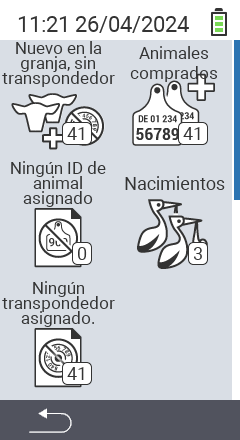

{}
Si haces clic en un elemento del menú, serás redirigido a una descripción de la función respectiva.
{}

<map name="workmap">
  <area shape="rect" coords="3,40,116,160" alt="Nuevo en la granja, sin transpondedor" title="Aquí asignas un transpondedor a nuevos animales sin transpondedor&#10;Clic del ratón: abrir documentación" href="/es/docs/new-on-farm/new-no-transponder/">
  <area shape="rect" coords="3,160,116,280" alt="No se ha asignado ID nacional de animal" title="Aquí puedes ver todos los animales a los que aún no se les ha asignado un ID nacional de animal y asignar un ID nacional de animal&#10;Clic del ratón: abrir documentación" href="/es/docs/new-on-farm/no-national-animal-id-assigned/">
  <area shape="rect" coords="3,280,116,399" alt="No se ha asignado transpondedor" title="Aquí puedes ver todos los animales a los que aún no se les ha asignado un transpondedor y asignarles un transpondedor&#10;Clic del ratón: abrir documentación" href="/es/docs/new-on-farm/no-transponder-assigned/">

  <area shape="rect" coords="116,40,230,160" alt="Animales comprados" title="Aquí puedes ver tus compras actuales y exportar los datos&#10;Clic del ratón: abrir documentación" href="/es/docs/new-on-farm/purchased-animals/">
  <area shape="rect" coords="116,160,230,280" alt="Nacimientos" title="Aquí puedes ver tus nacimientos y crear un archivo de exportación&#10;Clic del ratón: abrir documentación" href="/es/docs/new-on-farm/births/">
  <area shape="rect" coords="1,401,100,439" alt="Atrás" title="Regresar un nivel&#10;Clic del ratón: a la documentación" href="/es/docs/menu/mainmenu/">
</map>
