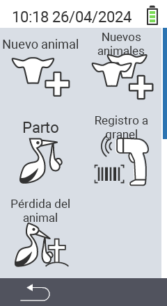

A través del elemento principal del menú  `` se accede a un submenú, donde se presentan 5 subítems para seleccionar:

<map name="workmap">
  <area shape="rect" coords="3,40,116,160" alt="Nuevo animal" title="Cómo registrar un nuevo animal usando el dispositivo VitalControl&#10;Clic del ratón: abrir documentación" href="/es/docs/new/animal/">
  <area shape="rect" coords="3,160,116,280" alt="Parto" title="Cómo registrar un nuevo parto usando el dispositivo VitalControl&#10;Clic del ratón: abrir documentación" href="/es/docs/new/calving/">
  <area shape="rect" coords="3,280,116,399" alt="Pérdida de animal" title="Cómo registrar la pérdida de un animal usando el dispositivo VitalControl&#10;Clic del ratón: abrir documentación" href="/es/docs/new/animal-loss/">

  <area shape="rect" coords="116,40,230,160" alt="Nuevos animales" title="Cómo crear múltiples nuevos animales en el dispositivo VitalControl usando una sola acción&#10;Clic del ratón: abrir documentación" href="/es/docs/new/animals/">
  <area shape="rect" coords="116,160,230,280" alt="Registro masivo" title="Usa el escáner de código de barras para registrar una variedad de animales&#10;Clic del ratón: abrir documentación" href="/es/docs/new/bulk-recording/">

  <area shape="rect" coords="1,401,100,439" alt="Atrás" title="Regresar un nivel&#10;Clic del ratón: a la documentación" href="/es/docs/menu/mainmenu/">
</map>

{}
Cada submenú lleva su propio icono. Mueva el puntero del ratón sobre un icono en la gráfica anterior y déjelo reposar un momento. Aparecerá un tooltip mostrando información para el submenú seleccionado. Si hace clic en uno de los iconos, será redirigido a una descripción del ítem del submenú seleccionado.
{}
