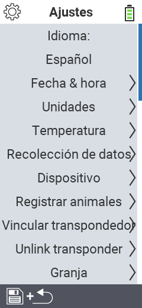

{}
Si haces clic en un elemento del menú, serás redirigido a una descripción de la función respectiva.
{}

<map name="workmap">
  <area shape="rect" coords="2,40,230,120" alt="Idioma" title="Configura y guarda permanentemente el idioma de la interfaz de usuario en tu dispositivo VitalControl&#10;Clic del ratón: abrir documentación" href="/es/docs/settings/language/">
  <area shape="rect" coords="2,120,230,160" alt="Fecha y hora" title="Aquí configuras la fecha y la hora&#10;Clic del ratón: abrir documentación" href="/es/docs/settings/datetime/">
  <area shape="rect" coords="2,160,230,200" alt="Unidades" title="Aquí seleccionas las unidades para temperatura y masa&#10;Clic del ratón: abrir documentación" href="/es/docs/settings/units/">
  <area shape="rect" coords="2,200,230,240" alt="Temperatura" title="Configura los ajustes de temperatura para la aplicación de tu dispositivo VitalControl&#10;Clic del ratón: abrir documentación" href="/es/docs/settings/temperature/">
   <area shape="rect" coords="2,240,230,280" alt="Adquisición de datos" title="Aquí almacenas información relevante para la recolección de datos del animal&#10;Clic del ratón: abrir documentación" href="/es/docs/settings/data-acquisition/">
   <area shape="rect" coords="2,280,230,320" alt="Dispositivo" title="Aquí puedes ajustar varios ajustes del dispositivo&#10;Clic del ratón: abrir documentación" href="/es/docs/settings/device/">
   <area shape="rect" coords="2,320,230,360" alt="Registro de animales" title="Aquí puedes ajustar varios estándares preestablecidos de fábrica sobre el registro de nuevos animales a los requisitos de tu granja.&#10;Clic del ratón: abrir documentación" href="/es/docs/settings/animal-registration/">
   <area shape="rect" coords="2,360,230,400" alt="Vincular transpondedor" title="Configura la asignación del transpondedor en tu dispositivo VitalControl&#10;Clic del ratón: abrir documentación" href="/es/docs/settings/transponder-linkage/">
   <area shape="rect" coords="2,400,230,439" alt="Desvincular transpondedor" title="Especifica cómo se asignará la ID del animal después de que el transpondedor sea desprendido&#10;Clic del ratón: abrir documentación" href="/es/docs/settings/transponder-linkage/">
   <area shape="rect" coords="2,440,230,480" alt="Granja" title="Guarda permanentemente tu ID nacional de granja de doce dígitos oficial en el dispositivo VitalControl&#10;Clic del ratón: abrir documentación" href="/es/docs/settings/farm-number/">
   <area shape="rect" coords="2,482,123,519" alt="Regresar" title="Regresar un nivel" href="/es/docs/menu/mainmenu/">
</map>
