
<a class="btn btn-lg btn-primary me-3 mb-4" href="#td-block-2">
  Uuri lähemalt <i class="fas fa-arrow-alt-circle-right ms-2"></i>
</a>
<a class="btn btn-lg btn-secondary me-3 mb-4" href="docs/">
  Dokumentatsioon<i class="fa-solid fa-book ms-2 "></i>
</a>

Tervisehaldus kõrgeimal tasemel!




{}

**Vähenda** **paberimajandust**  

**Paranda** oma **loomade tervist**

Ole **kõigega** **kursis**   

Kasutades vaid **üht seadet**     
{}


{}
 

    

    <button type="button" data-bs-target="#carouselLanguageIndicators" data-bs-slide-to="0" class="active" aria-current="true" aria-label="Saksa"></button>
    <button type="button" data-bs-target="#carouselLanguageIndicators" data-bs-slide-to="1" aria-label="Inglise"></button>
    <button type="button" data-bs-target="#carouselLanguageIndicators" data-bs-slide-to="2" aria-label="Hollandi"></button>
    <button type="button" data-bs-target="#carouselLanguageIndicators" data-bs-slide-to="3" aria-label="Soome"></button>
    <button type="button" data-bs-target="#carouselLanguageIndicators" data-bs-slide-to="4" aria-label="Prantsuse"></button>
    <button type="button" data-bs-target="#carouselLanguageIndicators" data-bs-slide-to="5" aria-label="Vene"></button>
    <button type="button" data-bs-target="#carouselLanguageIndicators" data-bs-slide-to="6" aria-label="Hispaania"></button>
    <button type="button" data-bs-target="#carouselLanguageIndicators" data-bs-slide-to="7" aria-label="Bosnia"></button>
    <button type="button" data-bs-target="#carouselLanguageIndicators" data-bs-slide-to="8" aria-label="Bulgaaria"></button>
    <button type="button" data-bs-target="#carouselLanguageIndicators" data-bs-slide-to="9" aria-label="Hiina"></button>
    <button type="button" data-bs-target="#carouselLanguageIndicators" data-bs-slide-to="10" aria-label="Tšehhi"></button>
    <button type="button" data-bs-target="#carouselLanguageIndicators" data-bs-slide-to="11" aria-label="Norra"></button>
    <button type="button" data-bs-target="#carouselLanguageIndicators" data-bs-slide-to="12" aria-label="Kreeka"></button>
    <button type="button" data-bs-target="#carouselLanguageIndicators" data-bs-slide-to="13" aria-label="Türgi"></button>
    <button type="button" data-bs-target="#carouselLanguageIndicators" data-bs-slide-to="14" aria-label="Ukraina"></button>
    <button type="button" data-bs-target="#carouselLanguageIndicators" data-bs-slide-to="15" aria-label="Eesti"></button>
    
 

    

      

        <h3>Saksa</h3>
      

      
    

    

      

        <h3>Hollandi</h3>
      

      
    

    

      

        <h3>Inglise</h3>
      

      
    

    

      

        <h3>Soome</h3>
      

      
    

    

      

        <h3>Prantsuse</h3>
      

      
    

    

      

        <h3>Vene</h3>
      

    
    
  
    

      

        <h3>Hispaania</h3>
      

    
    

      

        

          <h3>Bosnia</h3>
        

      
      

      

        

          <h3>Bulgaaria</h3>
        

      
      

      

        

          <h3>Hiina</h3>
        

      
      

      

        

          <h3>Tšehhi</h3>
        

      
      

      

        

          <h3>Norra</h3>
        

      
      

      

        

          <h3>Kreeka</h3>
        

      
      
      
      

        

          <h3>Türgi</h3>
        

      
      
 
      

        

          <h3>Ukraina</h3>
        

      
      
 
      

        

          <h3>Eesti</h3>
        

      
      
 
  

  <button class="carousel-control-prev" type="button" data-bs-target="#carouselLanguagesAutoplaying" data-bs-slide="prev" style="left: 0px; top: 37px; height: 320px;">
    
    Eelmine
  </button>
  <button class="carousel-control-next" type="button" data-bs-target="#carouselLanguagesAutoplaying" data-bs-slide="next" style="right: 0px; top: 37px; height: 320px;">
    
    Järgmine
  </button>

{}

{}
 

    

    <button type="button" data-bs-target="#carouselActionsIndicators" data-bs-slide-to="0" class="active" aria-current="true" aria-label="Temperatuur"></button>
    <button type="button" data-bs-target="#carouselActionsIndicators" data-bs-slide-to="1" aria-label="Kaalumine"></button>
    <button type="button" data-bs-target="#carouselActionsIndicators" data-bs-slide-to="2" aria-label="Hindamine"></button>
    <button type="button" data-bs-target="#carouselActionsIndicators" data-bs-slide-to="3" aria-label="Tegevuste ahel"></button>
    <button type="button" data-bs-target="#carouselActionsIndicators" data-bs-slide-to="4" aria-label="Häire"></button>
    <button type="button" data-bs-target="#carouselActionsIndicators" data-bs-slide-to="5" aria-label="Valves"></button>
    <button type="button" data-bs-target="#carouselActionsIndicators" data-bs-slide-to="6" aria-label="Looma ajalugu"></button>
    <button type="button" data-bs-target="#carouselActionsIndicators" data-bs-slide-to="7" aria-label="Muuda"></button>
    <button type="button" data-bs-target="#carouselActionsIndicators" data-bs-slide-to="8" aria-label="Eemalda registrist"></button>
    <button type="button" data-bs-target="#carouselActionsIndicators" data-bs-slide-to="9" aria-label="Looma kadu"></button>
    <button type="button" data-bs-target="#carouselActionsIndicators" data-bs-slide-to="10" aria-label="Ühenda transponder"></button>
    <button type="button" data-bs-target="#carouselActionsIndicators" data-bs-slide-to="11" aria-label="Eemalda transponderi ühendus"></button>
    <button type="button" data-bs-target="#carouselActionsIndicators" data-bs-slide-to="12" aria-label="Ühenda looma ID"></button>
    <button type="button" data-bs-target="#carouselActionsIndicators" data-bs-slide-to="13" aria-label="Ühenda elektrooniline looma ID"></button>
  

    

      

        <h3>Temperatuur</h3>
      

      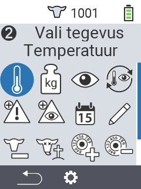
    

    

      

        <h3>Kaalumine</h3>
      

      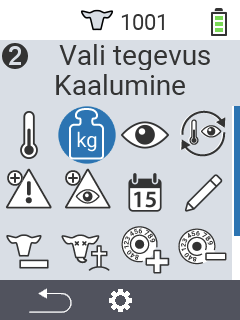
    

    

      

        <h3>Hindamine</h3>
      

      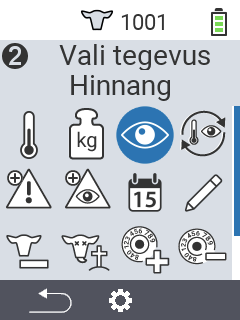
    

    

      

        <h3>Tegevuste ahel</h3>
      

      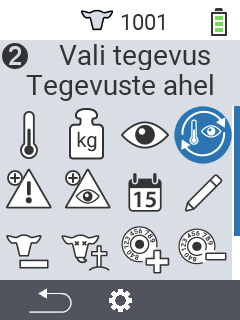
    

    

      

        <h3>Häire</h3>
      

      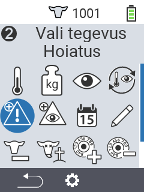
    

    

      

        <h3>Valves</h3>
      

      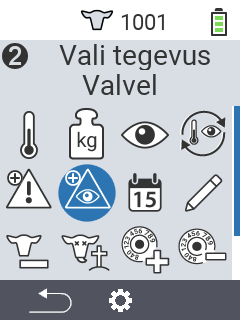
    

    

      

        <h3>Looma ajalugu</h3>
      

      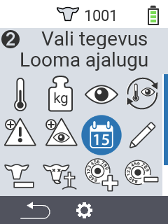
    

    

      

        <h3>Muuda</h3>
      

      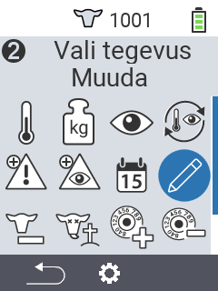
    

    

      

        <h3>Eemalda registrist</h3>
      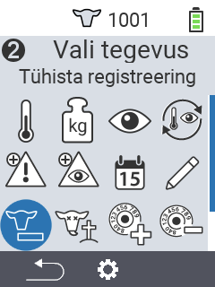
      

    

    

      

        <h3>Looma kadu</h3>
      

      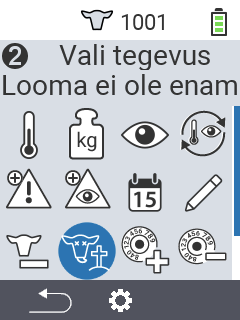
    

    

      

        <h3>Ühenda transponder</h3>
      

      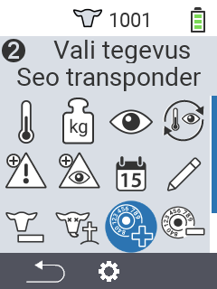
    

    

      

        <h3>Eemalda transponderi ühendus</h3>
      

      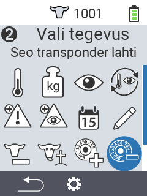
    
      
    

      

        <h3>Ühenda looma ID</h3>
      

      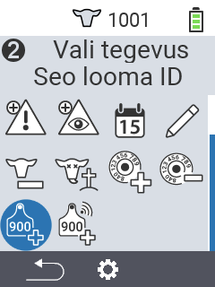
    
   
    

      

        <h3>Ühenda looma ID</h3>
      

      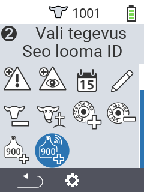
    
             
  

  <button class="carousel-control-prev" type="button" data-bs-target="#carouselActionsAutoplaying" data-bs-slide="prev" style="left: 0px; top: 37px; height: 320px;">
    
    Eelmine
  </button>
  <button class="carousel-control-next" type="button" data-bs-target="#carouselActionsAutoplaying" data-bs-slide="next" style="right: 0px; top: 37px; height: 320px;">
    
    Järgmine
  </button>

{}

{}
 

    

    <button type="button" data-bs-target="#carouselListsIndicators" data-bs-slide-to="0" class="active" aria-current="true" aria-label="Häire"></button>
    <button type="button" data-bs-target="#carouselListsIndicators" data-bs-slide-to="1" aria-label="Valves"></button>
    <button type="button" data-bs-target="#carouselListsIndicators" data-bs-slide-to="2" aria-label="Tegevus"></button>
    <button type="button" data-bs-target="#carouselListsIndicators" data-bs-slide-to="3" aria-label="Värsked lehmad"></button>
    <button type="button" data-bs-target="#carouselListsIndicators" data-bs-slide-to="4" aria-label="Kuivad lehmad"></button>
  

    

      

        <h3>Häire</h3>
      

      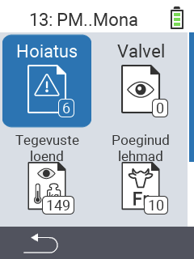
    

    

      

        <h3>Valves</h3>
      

      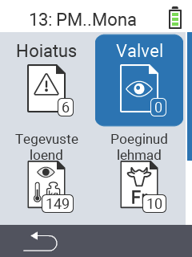
    

    

      

        <h3>Tegevusnimekiri</h3>
      
      
      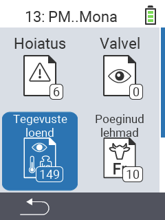
    

    

      

        <h3>Värsked lehmad</h3>
      

      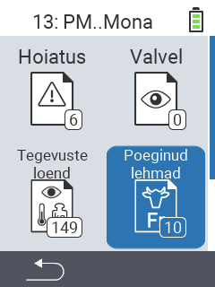
    

    

      

        <h3>Kuivad lehmad</h3>
      

    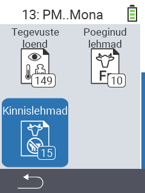
    

  

  <button class="carousel-control-prev" type="button" data-bs-target="#carouselListsAutoplaying" data-bs-slide="prev" style="left: 0px; top: 37px; height: 320px;">
    
    Eelmine
  </button>
  <button class="carousel-control-next" type="button" data-bs-target="#carouselListsAutoplaying" data-bs-slide="next" style="right: 0px; top: 37px; height: 320px;">
    
    Järgmine
  </button>

{}

{}
 

    

    <button type="button" data-bs-target="#carouselListsIndicators" data-bs-slide-to="0" class="active" aria-current="true" aria-label="Hinnangu kaal"></button>
    <button type="button" data-bs-target="#carouselListsIndicators" data-bs-slide-to="1" aria-label="Hinnangu temperatuur"></button>
    <button type="button" data-bs-target="#carouselListsIndicators" data-bs-slide-to="2" aria-label="Hinnangu reiting"></button>
    <button type="button" data-bs-target="#carouselListsIndicators" data-bs-slide-to="3" aria-label="Hinnangu suremus"></button>
  

    

      

        <h3>Kaal</h3>
      
 
      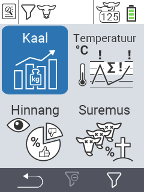
    

    

      

        <h3>Temperatuur</h3>
      
 
      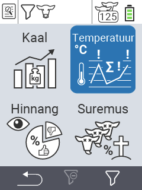
    

    

      

        <h3>Reiting</h3>
      
 
      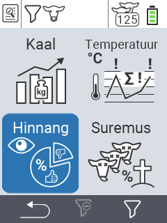
    

    

      

        <h3>Suremus</h3>
      
 
      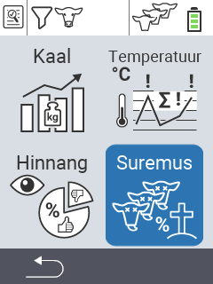
    

  

  <button class="carousel-control-prev" type="button" data-bs-target="#carouselEvaluationAutoplaying" data-bs-slide="prev" style="left: 0px; top: 37px; height: 320px;">
    
    Eelmine
  </button>
  <button class="carousel-control-next" type="button" data-bs-target="#carouselEvaluationAutoplaying" data-bs-slide="next" style="right: 0px; top: 37px; height: 320px;">
    
    Järgmine
  </button>

{}


{}

Sobib mitut tüüpi **loomadele** erinevates **vanustes**

{}


{}
 

 
{}

{}
 

 
{}

{}
 

 
{}



{}

Meie **esiletõstmised** teile

{}


{}
 

 
{}

{}
 
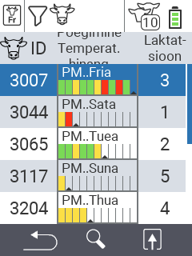
 
{}

{}
 

 
{}

{}
 
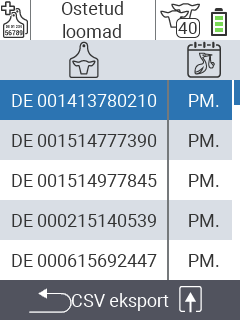
 
{}



{}
Urban sotsiaalmeedias

{}

{}

{}
{}

{}
{}

{}
{}

{}
{}


