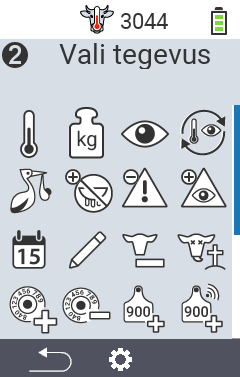
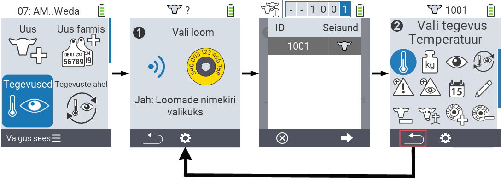

## Saadaolevad tegevused

Sõltuvalt looma tüübist saate looma jaoks sooritada kuni 16 erinevat tegevust.

<map name="workmap">
  <area shape="rect" coords="3,100,60,165" alt="Temperatuur" title="Mõõda oma loomade palavikku&#10;Hiireklõps: ava dokumentatsioon" href="/et/docs/actions/measure-temperature/">
  <area shape="rect" coords="60,100,118,165" alt="Kaalumine" title="Salvesta oma loomade kaal&#10;Hiireklõps: ava dokumentatsioon" href="/et/docs/actions/record-weight/">
  <area shape="rect" coords="118,100,174,165" alt="Hinnang" title="Anna oma loomadele hinnang&#10;Hiireklõps: ava dokumentatsioon" href="/et/docs/actions/rating/">
  <area shape="rect" coords="174,100,230,165" alt="Tegevuste jada" title="Rakenda ja seadista tegevuste jada&#10;Hiireklõps: ava dokumentatsioon" href="/et/docs/chain-of-actions/">
   <area shape="rect" coords="3,165,60,225" alt="Poegimine" title="Registreeri poegimine&#10;Hiireklõps: ava dokumentatsioon" href="/et/docs/actions/calving/">
   <area shape="rect" coords="60,165,120,225" alt="Lüpsilõpetamine" title="Lõpeta lehma lüpsmine või lisa ta värskete lehmade nimekirja&#10;Hiireklõps: ava dokumentatsioon" href="/et/docs/actions/dry-off/">
   <area shape="rect" coords="120,165,175,225" alt="Häire" title="Lisa ja eemalda loomi häire nimekirjast&#10;Hiireklõps: ava dokumentatsioon" href="/et/docs/actions/alarm/">
   <area shape="rect" coords="175,165,230,225" alt="Valves" title="Pane loomad valves olevate nimekirja või eemalda neid&#10;Hiireklõps: ava dokumentatsioon" href="/et/docs/actions/on-watch/">
   <area shape="rect" coords="3,225,60,280" alt="Looma ajalugu" title="Vaata looma ajalugu&#10;Hiireklõps: ava dokumentatsioon" href="/et/docs/actions/animal-history/">
   <area shape="rect" coords="60,225,120,280" alt="Muuda" title="Muuda valitud looma andmeid&#10;Hiireklõps: ava dokumentatsioon" href="/et/docs/actions/edit/">
   <area shape="rect" coords="120,225,175,280" alt="Eemalda registreering" title="Eemalda looma registreering&#10;Hiireklõps: ava dokumentatsioon" href="/et/docs/actions/unregister/">
   <area shape="rect" coords="175,225,230,280" alt="Looma kaotus" title="Registreeri looma kaotus&#10;Hiireklõps: ava dokumentatsioon" href="/et/docs/actions/animal-loss/">
   <area shape="rect" coords="3,280,60,337" alt="Seo transponder" title="Määra loomale transponder&#10;Hiireklõps: ava dokumentatsioon" href="/et/docs/actions/link-transponder/">
   <area shape="rect" coords="55,280,120,337" alt="Eemalda transponderi seos" title="Eemalda loomalt transponderi seos&#10;Hiireklõps: ava dokumentatsioon" href="/et/docs/actions/unlink-transponder/">
   <area shape="rect" coords="120,280,175,337" alt="Seo looma ID käsitsi" title="Määra loomale, kellel puudub rahvuslik looma ID, rahvuslik looma ID&#10;Hiireklõps: ava dokumentatsioon" href="/et/docs/actions/link-animal-id/#link-animal-id">
   <area shape="rect" coords="175,280,230,337" alt="Seo looma ID skaneerimisega" title="Määra loomale, kellel puudub rahvuslik looma ID, rahvuslik looma ID elektroonilise kõrvamärgi skaneerimisega&#10;Hiireklõps: ava dokumentatsioon" href="/et/docs/actions/link-animal-id/#link-animal-id-with-electronic-ear-tag-scan">

<area shape="rect" coords="100,340,140,375" alt="Settings" title="Kutsu seaded üles&#10;Hiireklõps: dokumentatsioonile" href="/et/docs/actions/setting/">
</map>

{}
Iga tegevus on tähistatud sümboliga. Liiguta kursorit graafikul allpool oleva sümboli kohale ja hoia seda hetkeks paigal. Ilmub tööriistavihje, mis esitab teavet vastava tegevuse kohta. Kui klõpsate mõnel sümbolil, suunatakse teid vastava tegevuse kirjelduse juurde.
{}

## Üldine protseduur

Menüüs  `Tegevused` saate igal ajal valida järgmise looma, ilma et peaksite menüüpunkti Tegevused lahkuma. Järgmise looma valimiseks toimige järgmiselt:

1. Valige põhiekraanil menüüpunkt  `Tegevused` oma VitalControl seadmes ja vajutage `OK` nuppu.

2. Skaneerige loom transponderi abil või valige loom nimekirjast. Kinnitage valik, vajutades `OK` ja valige loom noolenuppudega △ ▽. Kinnitage valikuga `OK`.

3. Avaneb alammenüü, kus leiate ikoone arvukate loomade tegevuste jaoks. Kasutage noolenuppe soovitud tegevuse valimiseks ja alustage tegevust, vajutades `OK` nuppu. Valitud tegevusest sõltuvalt ilmub üks või mitu ekraani või hüpikaken.

4. Soovi korral võite nüüd valida ja teostada teise tegevuse praegusele loomale.

5. Pärast soovitud tegevuste teostamist loomale naaske sammu 2 juurde 'Looma valik'. Selleks vajutage vasakpoolset nuppu `F1` all vasakus nurgas asuva `Tagasi` sümboli all.

6. Sellest sammust avaneb automaatselt uuesti aken ja saate valida järgmise looma või naasta põhimenüüsse, vajutades `F1` nuppu `Tagasi` sümboli all.



{}

{}
{}

{}


Please paste the Markdown content you want to translate into Estonian.
