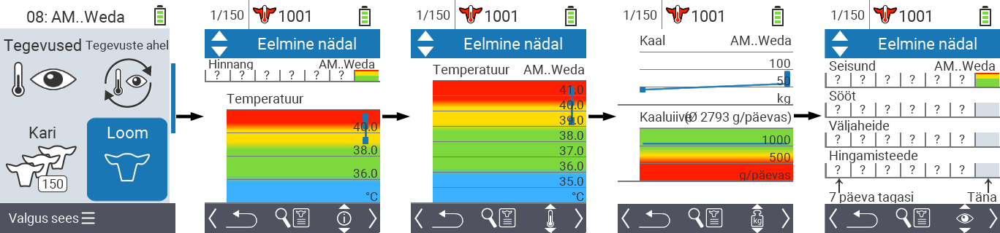
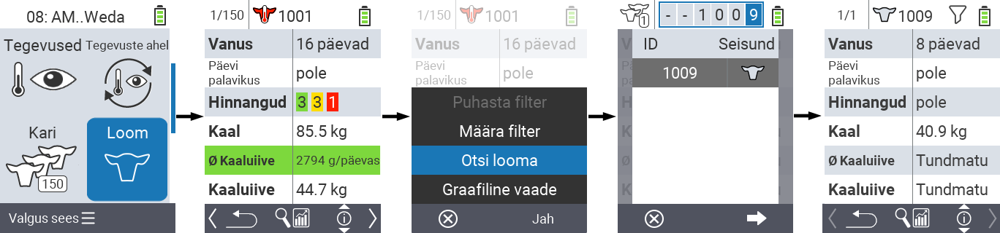
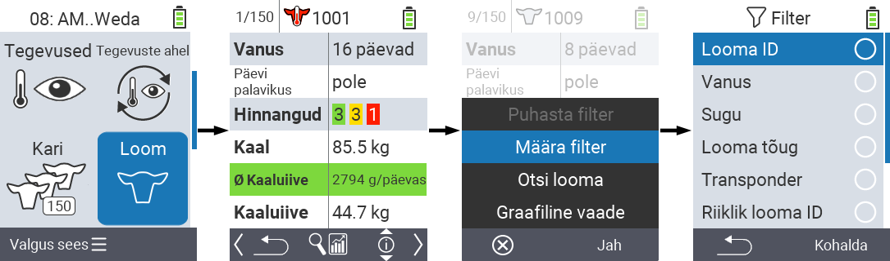

## Loom

Üksiklooma funktsioon võimaldab vaadata olulist teavet iga üksiklooma kaalu, temperatuuri ja hinnangu kohta. Teil on alati võimalus kuvada teavet graafiliselt või nimekirjana. Üksiklooma funktsiooni kasutamiseks toimige järgmiselt:

1. Oma VitalControl seadme põhiekraanil valige menüüpunkt  `Loom` ja vajutage `OK` nuppu.

2. Avaneb ülevaade olulisemast looma teabest. Ekraani ülemine äär näitab, millist looma te hetkel vaatate. Kasutage `F3` klahvi, et valida looma teabe , temperatuuri , kaalu   ja hinnangu  vahel.

{}
Iga teabe kuvamise juures on teil võimalus [otsida looma](#search-animal), seada [filter](#set-filter) ja lülituda [graafilisele vaatele](#set-graphical-view).
Samuti võite igal ajal loomade vahel liikuda kasutades nooleklahve ◁ ▷.
{}

### Seadista graafiline vaade

1. Vajutage keskmist ülemist `On/Off` nuppu , et avada hüpikmenüü. Selles menüüs saate valida funktsioonide `Seadista filter`, `Otsi looma` või `Graafiline vaade` vahel.

2. Valige nooleklahvidega △ ▽ `Graafiline vaade` ja kinnitage `OK`-ga.

### Looma otsing

1. Vajutage keskmist ülemist `On/Off` nuppu  hüpikmenüü avamiseks. Selles menüüs saate valida funktsioonide `Sea filter`, `Otsi looma` või `Graafiline vaade` vahel.

2. Valige nooleklahvidega △ ▽ `Otsi looma` ja kinnitage valik `OK`-ga.

3. Kasutage nooleklahve △ ▽ ◁ ▷ soovitud looma numbri valimiseks ja kinnitage `OK`-ga.

### Sea filter

1. Vajutage keskmist ülemist `On/Off` nuppu  hüpikmenüü avamiseks. Selles menüüs saate valida funktsioonide `Sea filter`, `Otsi looma` või `Graafiline vaade` vahel.

2. Valige nooleklahvidega △ ▽ `Sea filter` ja kinnitage valik `OK`-ga.
Filtriga töötamise juhised leiate [siit]().

