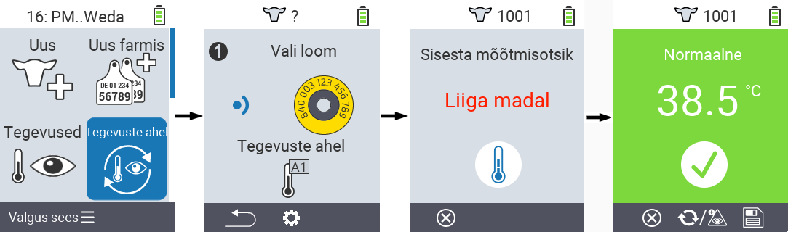
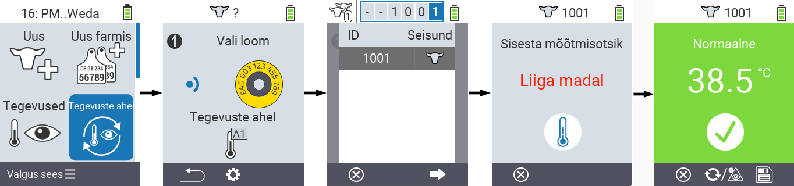
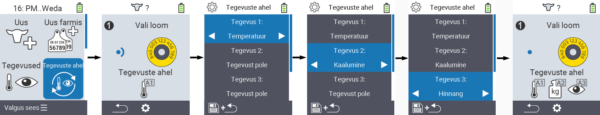

## Tegevuste ahel

Tegevuste ahel võimaldab automaatselt sooritada mitmeid tegevusi looma jaoks üksteise järel. Näiteks võite valida tegevused `Temperatuuri mõõtmine` ja `Hinnang`. Kui te seejärel tegevuste ahelat rakendate, saate esmalt mõõta oma looma temperatuuri ja kohe seejärel salvestada hinnangu.

### Tegevuste ahela kasutamine

1. Oma VitalControl seadme põhiekraanil valige menüüpunkt &nbsp;&nbsp; `Tegevuste ahel` ja vajutage `OK` nuppu.

2. Skaneerige loom transponderi abil või kinnitage valik `OK`-ga ja kasutage nooleklahve △ ▽ ◁ ▷ soovitud looma ID sisestamiseks.

3. Tegevuste ahel viiakse nüüd täide. Niipea kui kõik tegevuste ahelas olevad tegevused on sooritatud, saab kohe valida järgmise looma.



{}

{}
{}

{}


### Tegevuste ahela seadistamine

1. Oma VitalControl seadme põhiekraanil valige menüüpunkt &nbsp;&nbsp; `Tegevuste ahel` ja vajutage `OK` nuppu.

2. Kasutage nuppu `F2` &nbsp;&nbsp; (`seaded`).

3. Ilmub ülekatte ekraan. Kasutage nooleklahve △ ▽ loetletud tegevuste 1 - 4 vahel valimiseks (saate järjest sooritada kuni neli tegevust). Kasutage nooleklahve ◁ ▷ soovitud tegevuse valimiseks vastava tegevuse jaoks. Salvestage seaded klahviga `F1` &nbsp;&nbsp;.

4. Kui soovite kogu tegevuste ahela lähtestada, valige alammenüüst suvand `Reset chain of actions`, kasutades nooleklahve △ ▽ ja kinnitage valikuga `OK`.

    

{}
Üksikute tegevuste puhul on teil samad seadistamisvõimalused nagu peatükis [Tegevused](../actions) kirjeldatud iga üksiku tegevuse jaoks.
{}

{}
Tegevuste ahela avakuva sümbolid näitavad, millised tegevused olete seadistanud ja millises järjekorras.
{}
