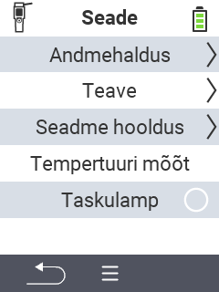

{}
Kui klõpsate menüüelemendil, suunatakse teid vastava funktsiooni kirjeldusele.
{}

<map name="workmap">
  <area shape="rect" coords="2,40,238,80" alt="Andmehaldus" title="Käivita andmete varundamine, ekspordi oma andmed ja taasta seade&#10;Hiireklõps: ava dokumentatsioon" href="/et/docs/device/data-management/">
  <area shape="rect" coords="2,80,238,120" alt="Info" title="Vaata olulist tarkvara ja riistvara teavet&#10;Hiireklõps: ava dokumentatsioon" href="/et/docs/device/info/">
  <area shape="rect" coords="2,120,238,160" alt="Hooldus" title="Kontrolli oma seadme draivereid, uuenda oma püsivara ja tee ulatuse test&#10;Hiireklõps: ava dokumentatsioon" href="/et/docs/device/service/">
  <area shape="rect" coords="2,160,238,200" alt="Temperatuuri mõõtmine" title="Testi oma seadme temperatuuri mõõtmist&#10;Hiireklõps: ava dokumentatsioon" href="/et/docs/device/temperature-measurement/">
  <area shape="rect" coords="2,200,238,240" alt="Taskulamp" title="Lülita oma VitalControl seadme valgus sisse või välja&#10;Hiireklõps: ava dokumentatsioon" href="/et/docs/device/flashlight/">

  <area shape="rect" coords="2,282,97,318" alt="Tagasi" title="Hüppa tagasi ühe taseme võrra" href="/et/docs/menu/mainmenu/">
</map>
