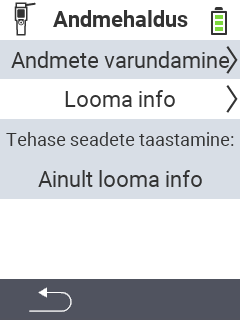

{}
Kui klõpsate menüüelemendil, suunatakse teid vastava funktsiooni kirjeldusele.
{}

<map name="workmap">
  <area shape="rect" coords="2,40,238,80" alt="Andmete varundamine" title="Juhised varukoopia loomiseks leiate siit&#10;Hiireklõps: ava dokumentatsioon" href="/et/docs/device/data-management/data-backup/">

  <area shape="rect" coords="2,80,238,120" alt="Looma andmed" title="Juhised varukoopia taastamiseks leiate siit&#10;Hiireklõps: ava dokumentatsioon" href="/et/docs/device/data-management/animal-data/">

  <area shape="rect" coords="2,120,238,200" alt="Tehaseseadete taastamine" title="Kogu teave ja juhised seadme ning looma andmete lähtestamiseks leiate siit&#10;Hiireklõps: ava dokumentatsioon" href="/et/docs/reset/">

  <area shape="rect" coords="2,282,120,319" alt="Tagasi" title="Kogu teave ja juhised looma andmete eksportimiseks leiate siit&#10;Hiireklõps: ava dokumentatsioon" href="/et/docs/device/">
</map>
