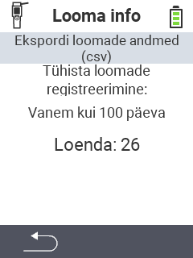

<map name="workmap">
  <area shape="rect" coords="2,40,238,80" alt="Ekspordi loomaandmed (csv)" title="Ekspordi oma loomaandmed&#10;Hiireklõps: ava dokumentatsioon" href="/et/docs/data-export/usb-drive/">

  <area shape="rect" coords="2,80,238,200" alt="Eemalda loomade registreering" title="Määratle vanus, millest alates loomad tuleks registreerimata jätta&#10;Hiireklõps: ava dokumentatsioon" href="/et/docs/device/data-management/animal-data/unregister-animal/">

  <area shape="rect" coords="2,282,120,319" alt="Tagasi" title="Kogu informatsioon ja juhised loomaandmete eksportimiseks leiate siit&#10;Hiireklõps: ava dokumentatsioon" href="/et/docs/device/data-management/">
</map>
