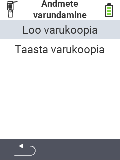

<map name="workmap">
  <area shape="rect" coords="2,40,238,80" alt="Loo varukoopia" title="Varukoopia loomise juhised leiate siit&#10;Hiireklõps: ava dokumentatsioon" href="/et/docs/backup/backup/">

  <area shape="rect" coords="2,80,238,120" alt="Taasta varukoopia" title="Varukoopia taastamise juhised leiate siit&#10;Hiireklõps: ava dokumentatsioon" href="/et/docs/backup/restore/">

  <area shape="rect" coords="2,282,120,319" alt="Tagasi" title="Hüppa tagasi ühe taseme võrra&#10;Hiireklõps: ava dokumentatsioon" href="/et/docs/device/data-management/">
</map>
