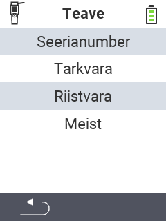

{}
Kui klõpsate menüüelemendil, suunatakse teid vastava funktsiooni kirjeldusele.
{}

<map name="workmap">
  <area shape="rect" coords="2,40,238,80" alt="Seerianumber" title="Seadme seerianumbri vaatamiseks klõpsake siin&#10;Mausklick: zur Dokumentation" href="/et/docs/device/info/serial-number/">
  <area shape="rect" coords="2,80,238,120" alt="Tarkvara" title="Juhised tarkvaraversiooni vaatamiseks leiate siit&#10;Mausklick: zur Dokumentation" href="/et/docs/firmware/versions/">
  <area shape="rect" coords="2,120,238,160" alt="Riistvara" title="Seadme riistvarainfo vaatamiseks klõpsake siin&#10;Mausklick: zur Dokumentation" href="/et/docs/device/info/hardware/">
  <area shape="rect" coords="2,160,238,200" alt="Teave" title="Kutsu esile müüja informatsioon&#10;Mausklick: zur Dokumentation" href="/et/docs/device/info/about/">

  <area shape="rect" coords="2,282,120,319" alt="Tagasi" title="Hüppa tagasi ühe taseme võrra&#10;Mouse click: open documentation" href="/et/docs/device/">
</map>
