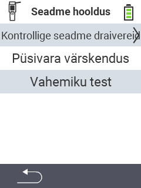

{}
Kui klõpsate menüüelemendil, suunatakse teid vastava funktsiooni kirjeldusele.
{}

<map name="workmap">
  <area shape="rect" coords="2,42,238,82" alt="Kontrollige seadme draivereid" title="Juhised oma seadme draiverite kontrollimiseks leiate siit&#10;Hiireklõps: ava dokumentatsioon" href="/et/docs/diagnosis/hardware/">
  <area shape="rect" coords="2,82,238,122" alt="Püsivara uuendus" title="Juhised oma püsivara uuendamiseks leiate siit&#10;Hiireklõps: ava dokumentatsioon" href="/et/docs/firmware/update/">
  <area shape="rect" coords="2,122,238,162" alt="Ulatus test" title="Juhised ulatuse testi tegemiseks leiate siit&#10;Hiireklõps: ava dokumentatsioon" href="/et/docs/diagnosis/rfid-scan/">

  <area shape="rect" coords="2,282,120,319" alt="Tagasi" title="Hüppa tagasi ühe taseme võrra&#10;Hiireklõps: ava dokumentatsioon" href="/et/docs/device/">
</map>
