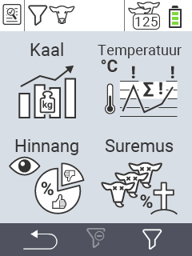

{}
Kui klõpsate menüüelemendil, suunatakse teid vastava funktsiooni kirjeldusele.
{}

<map name="workmap">
  <area shape="rect" coords="3,40,116,160" alt="Kaal" title="Hinda oma salvestatud andmeid kaalu jaotises&#10;Hiireklõps: ava dokumentatsioon" href="/et/docs/evaluation/weight/">
  <area shape="rect" coords="3,160,116,279" alt="Hinnang" title="Hinda oma salvestatud andmeid hinnangu jaotises&#10;Hiireklõps: ava dokumentatsioon" href="/et/docs/evaluation/rating/">

  <area shape="rect" coords="116,40,238,160" alt="Temperatuur" title="Hinda oma salvestatud andmeid temperatuuri jaotises&#10;Hiireklõps: ava dokumentatsioon" href="/et/docs/evaluation/temperature/">
  <area shape="rect" coords="116,160,238,279" alt="Suremus" title="Hinda oma salvestatud andmeid suremuse jaotises&#10;Hiireklõps: ava dokumentatsioon" href="/et/docs/evaluation/mortality/">

  <area shape="rect" coords="150,282,238,319" alt="Filter" title="Sea filter&#10;Hiireklõps: dokumentatsiooni juurde" href="/et/docs/filter">
  <area shape="rect" coords="2,282,95,319" alt="Tagasi" title="Hüppa tagasi ühe taseme võrra&#10;Hiireklõps: dokumentatsiooni juurde" href="/et/docs/menu/mainmenu/">
</map>
