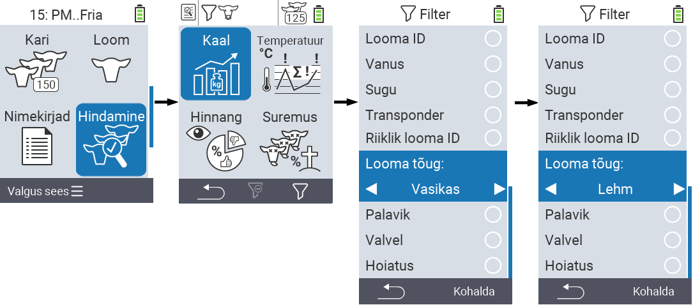
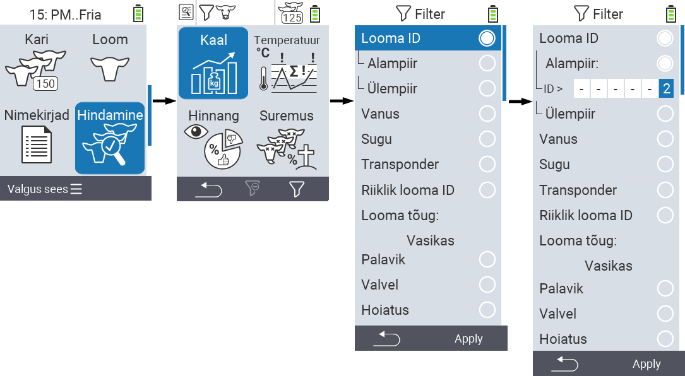
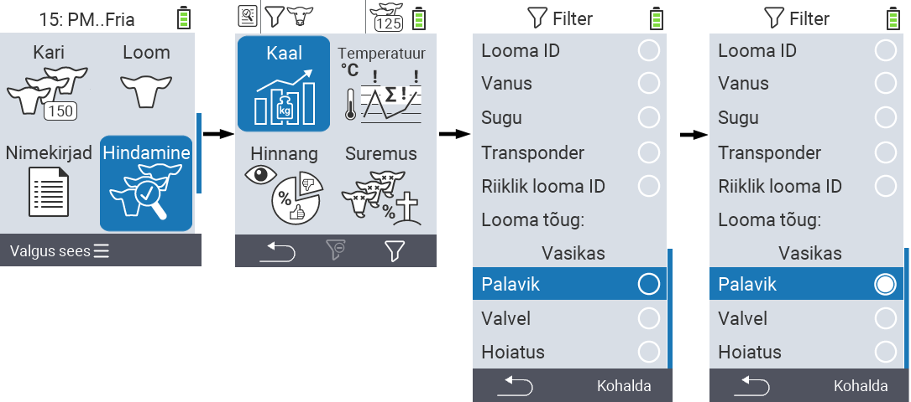

## Filtreerimine

{}
Filter aitab teil menüüpunktides `Kari`, `Nimekirjad` ja `Hindamine` VitalControl seadmes filtreerimiskriteeriumide abil valikut teostada. Niipea kui rakendate filtrit, ilmuvad ekraani ülaossa erinevate filtreerimiskriteeriumide sümbolid. Need sümbolid aitavad teil teada saada, kas ja millised filtreerimiskriteeriumid on aktiveeritud. Näiteks, kui seadistate `Sugu` filtri meessoost, kasutab seade ainult isaseid loomi. Näiteks, kui aktiveerite ka `Jälgimisel` filtri, kasutab seade ainult jälgimisnimekirjas olevaid isaseid loomi.
{}

Filtri loomiseks hindamistes toimige järgmiselt:

1. Alammenüüs, mis kuulub peamenüü punkti  `Hindamine` alla, vajutage klahvi `F3`  üks kord. Peamenüü punktide  `Nimekirjad` ja  `Kari` alammenüüs peate klahvi vajutama kaks korda.

2. Avaneb alammenüü, kus saate seada kõik filtri valikud. Saate filtreerida `Looma ID`, `Vanus`, `Sugu`, `Transponder`, `Riiklik looma ID`, `Palavik`, `Jälgimisel`, `Looma tüüp` ja `Häire` järgi.

3. Filtreerimiseks `Looma tüüp`, `Sugu`, `Transponder` ja `Riiklik looma ID` liikuge vastavasse piirkonda ja kinnitage `OK`-ga. Kasutage soovitud seadistuse määramiseks nooleklahve ◁ ▷. Valitud seadistuse rakendamiseks kasutage klahvi `F3` `Rakenda`. Filtri muudatuste tühistamiseks vajutage klahvi `F1` &nbsp;&nbsp;.

4. Filtreerimiseks `Looma ID` ja `Vanus` valige vastav kriteerium ja kinnitage `OK`-ga. Nüüd kuvatakse teile alumine ja ülemine piir. Liikuge soovitud piirini nooleklahvidega △ ▽ ja kinnitage vajutades `OK` kaks korda. Nüüd saate soovitud numbri seada nooleklahvidega ◁ ▷ ja nooleklahvidega △ ▽. Kui kõik seaded on õiged, vajutage uuesti `OK`, et lahkuda seadistusrežiimist ja rakendada valitud filter (filtrid) klahviga `F3` `Rakenda`. Klahviga `F1` &nbsp;&nbsp;, saate soovi korral muudatused tühistada.

5. Filtreerimiseks `Palavik`, `Jälgimisel` ja `Häire` on võimalik nende rakendamine keelata või lubada. Selleks valige vastav filter ja kinnitage `OK`-ga. Filter on nüüd aktiivne. Kinnitage uuesti `OK`-ga, et filter deaktiveerida.

6. Kui olete kõik filtrid seadnud, kasutage määratletud filtrite rakendamiseks klahvi `F3` `Rakenda` või vajutage filtrite muudatuste tühistamiseks klahvi `F1` .
