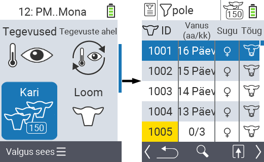
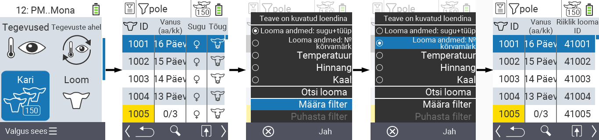
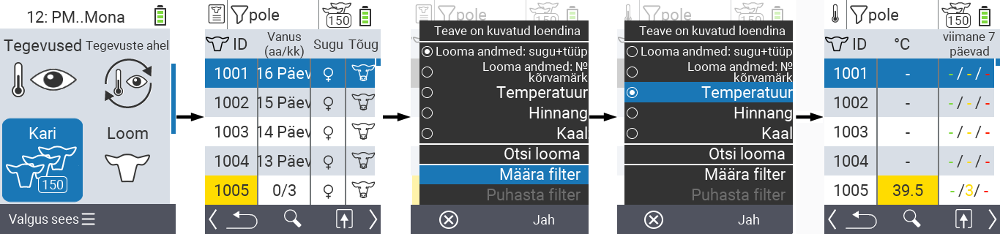
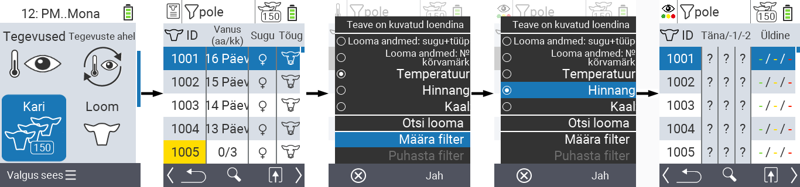
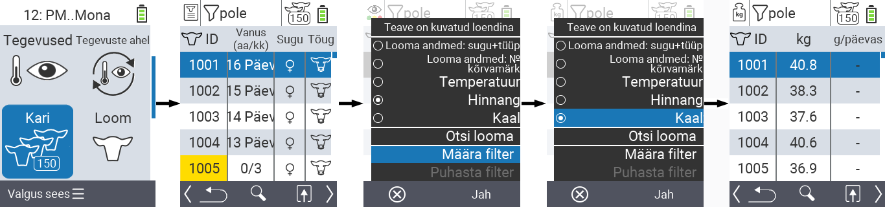
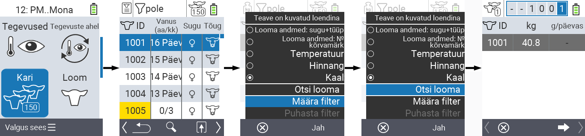
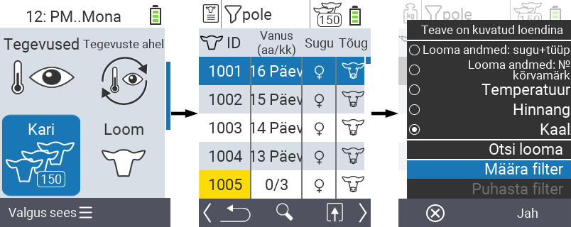
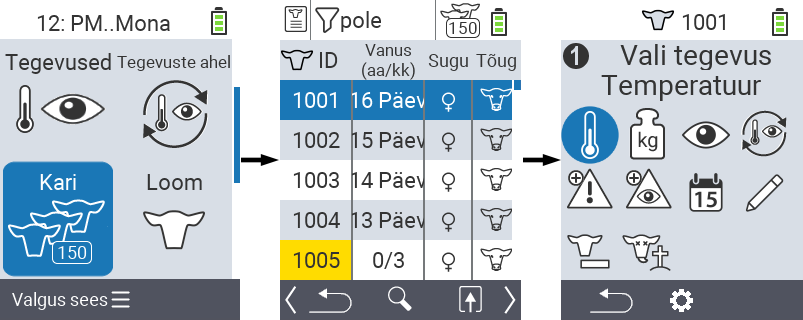

## Kari {#herd}

Karja menüüpunkti all saate vaadata kogu oma karja, otsida üksikuid loomi ja kuvada olulist informatsiooni. Teil on järgmised võimalused:

- Vaata [looma andmeid](#view-animal-data)
- Vaata [temperatuuri andmeid](#display-temperature)
- Vaata [hinnangu andmeid](#view-rating)
- Vaata [kaalu andmeid](#display-weight)
- [Otsi looma](#search-animal)
- Seadista [filter](#set-filter)
- [Tegevused](#call-action-menu)

### Ettevalmistavad sammud {#preparatory-steps}
 
1. Oma VitalControl seadme põhiekraanil valige menüüpunkt  `` ja vajutage `` nuppu.

2. Avaneb teie karja ülevaade.

    

### Vaata looma andmeid {#view-animal-data}

1. Täitke ettevalmistavad sammud.

2. Kasutage `F3` klahvi &nbsp;&nbsp; hüpikmenüü kutsumiseks, mis loetleb informatsioonikategooriad, mida saab karja nimekirjas kuvada. Kasutage nooleklahve △ ▽ rea `` või `` esiletõstmiseks ja valige see kategooria, vajutades keskset `` nuppu või `F3` klahvi ``. Kaks valikuvõimalust erinevad teabe riba kuvamises.

3. Looma andmed kuvatakse nüüd karja nimekirja sisuna.

4. Vaheldumisi võite kasutada nooleklahve ◁ ▷ erinevate kuvamisvõimaluste vahel liikumiseks.

    

{}
Vaikimisi kuvatakse esmalt looma andmed. Ainult siis, kui teil on näiteks kaal kuvatud, peate looma andmete kuvamise uuesti seadistama.
{}

### Kuvage temperatuur {#display-temperature}

1. Täitke ettevalmistavad sammud.

2. Kasutage klahvi `F3` &nbsp;&nbsp; et kutsuda esile hüpikmenüü, mis loetleb teabekategooriad, mida saab karja nimekirjas kuvada. Kasutage nooleklahve △ ▽, et esile tõsta rida `` ja valige see kategooria, vajutades keskset `` nuppu või klahvi `F3` ``.

3. Temperatuuri andmed kuvatakse nüüd karja nimekirja sisuna.

4. Alternatiivselt võite kasutada nooleklahve ◁ ▷, et vahetada erinevate kuvamisvalikute vahel.

    

### Vaata hinnangut {#view-rating}
 
1. Viige lõpule ettevalmistavad sammud.

2. Kasutage klahvi `F3` &nbsp;&nbsp; et kutsuda esile hüpikmenüü, mis loetleb teabekategooriad, mida saab karja nimekirjas kuvada. Kasutage nooleklahve △ ▽, et esile tõsta rida `` ja valige see kategooria, vajutades keskset `` nuppu või klahvi `F3` ``.

3. Hinnangu andmed kuvatakse nüüd karja nimekirja sisuna.

4. Alternatiivselt võite kasutada nooleklahve ◁ ▷, et vahetada erinevate kuvamisvalikute vahel.

    

### Kuva kaal {#display-weight}

1. Viige lõpule ettevalmistavad sammud.

2. Kasutage klahvi `F3` &nbsp;&nbsp; et kutsuda esile hüpikmenüü, mis loetleb teabekategooriad, mida saab karja nimekirjas kuvada. Kasutage nooleklahve △ ▽, et esile tõsta rida `` ja valige see kategooria, vajutades keskset `` nuppu või klahvi `F3` ``.

3. Kaalu andmed kuvatakse nüüd karja nimekirja sisuna.

4. Alternatiivselt võite kasutada nooleklahve ◁ ▷, et vahetada erinevate kuvamisvalikute vahel.

    

### Otsi looma {#search-animal}

1. Viige lõpule ettevalmistavad sammud.

2. Kasutage klahvi `F3` &nbsp;&nbsp; et kutsuda esile hüpikmenüü, mis loetleb erinevaid valikuid. Kasutage nooleklahve △ ▽, et esile tõsta funktsioon `` ja käivitage otsingufunktsioon, vajutades keskset `` nuppu või klahvi `F3` ``. Alternatiivselt võite kasutada kohe pärast esimest sammu `On/Off` nuppu .

3. Kasutage soovitud looma numbri sisestamiseks nooleklahve △ ▽ ◁ ▷ ja kinnitage valik nupuga ``.

    

### Seadista filter {#set-filter}

1. Täitke ettevalmistavad sammud.

2. Kasutage `F3` klahvi &nbsp;&nbsp; hüpikmenüü esile kutsumiseks, mis loetleb erinevaid valikuid. Kasutage nooleklahve △ ▽ funktsiooni `` esiletõstmiseks ja filtri funktsiooni käivitamiseks vajutage keskset `` nuppu või `F3` klahvi ``.

3. Kuidas filtrit rakendada, leiate [siit]().

    

### Kutsu esile tegevusmenüü {#call-action-menu}

Teil on alati võimalus looma jaoks tegevusmenüü esile kutsuda.

1. Täitke ettevalmistavad sammud.

2. Valige loendist loom nooleklahvide △ ▽ abil ja kinnitage valik nupuga ``.

3. Tegevusmenüü on nüüd avatud. Kuidas seda kasutada, leiate [siit](../actions).

4. Naaske kariloomade loendisse `F3` klahvi abil.

    
