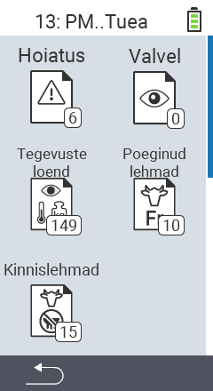

{}
Kui klõpsate menüüelemendil, suunatakse teid vastava funktsiooni kirjeldusele.
{}

<map name="workmap">
  <area shape="rect" coords="3,40,116,160" alt="Häirete nimekiri" title="Vaadake oma häirete nimekirja&#10;Hiireklõps: ava dokumentatsioon" href="/et/docs/lists/alarm/">
  <area shape="rect" coords="3,160,116,280" alt="Tegutsemise nimekiri" title="Vaadake oma tegutsemise nimekirja.&#10;Hiireklõps: ava dokumentatsioon" href="/et/docs/lists/actions/">
  <area shape="rect" coords="3,280,116,399" alt="Puhkeolekus lehmade nimekiri" title="Vaadake oma puhkeolekus lehmade nimekirja&#10;Hiireklõps: ava dokumentatsioon" href="/et/docs/lists/dry-cows/">

  <area shape="rect" coords="116,40,230,160" alt="Jälgimisnimekiri" title="Vaadake oma jälgimisnimekirja&#10;Hiireklõps: ava dokumentatsioon" href="/et/docs/lists/on-watch/">
  <area shape="rect" coords="116,160,230,280" alt="Värsked lehmad" title="Vaadake oma värskete lehmade nimekirja&#10;Hiireklõps: ava dokumentatsioon" href="/et/docs/lists/fresh-cows/">

  <area shape="rect" coords="2,401,115,438" alt="Tagasi" title="Hüppa tagasi ühe taseme võrra" href="/et/docs/menu/mainmenu/">
</map>
