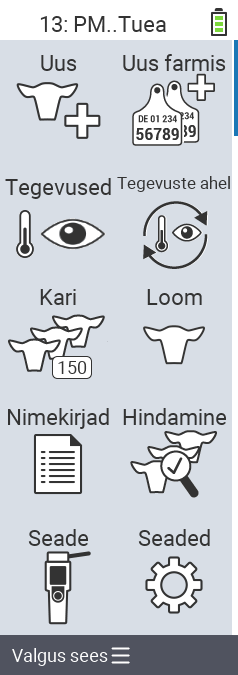

{}
Kui klõpsate menüüelemendil, suunatakse teid vastava funktsiooni kirjeldusele.
{}

<map name="workmap">
  <area shape="rect" coords="3,40,116,160" alt="Uus" title="Loo uued loomad&#10;Hiireklõps: ava dokumentatsioon" href="/et/docs/new/">
  <area shape="rect" coords="3,160,116,280" alt="Tegevused" title="Tegevused loomadega&#10;Hiireklõps: ava dokumentatsioon" href="/et/docs/actions/">
  <area shape="rect" coords="3,280,116,400" alt="Kari" title="Karimenüü&#10;Hiireklõps: ava dokumentatsioon" href="/et/docs/herd/">
  <area shape="rect" coords="3,400,116,520" alt="Nimekirjad" title="Loomade nimekirjad&#10;Hiireklõps: ava dokumentatsioon" href="/et/docs/lists/">
  <area shape="rect" coords="3,520,116,634" alt="Seade" title="Seade&#10;Hiireklõps: ava dokumentatsioon" href="/et/docs/device/">

  <area shape="rect" coords="116,40,230,160" alt="Uus farmis" title="Loomade juurdepääs&#10;Hiireklõps: ava dokumentatsioon" href="/et/docs/new-on-farm/">
  <area shape="rect" coords="116,160,230,280" alt="Tegevuste jada" title="Tegevuste jada&#10;Hiireklõps: ava dokumentatsioon" href="/et/docs/chain-of-actions/">
  <area shape="rect" coords="116,280,230,400" alt="Loom" title="Loom&#10;Hiireklõps: ava dokumentatsioon" href="/et/docs/animal/">
  <area shape="rect" coords="116,400,230,520" alt="Hindamine" title="Hindamine&#10;Hiireklõps: ava dokumentatsioon" href="/et/docs/evaluation/">
  <area shape="rect" coords="116,520,230,634" alt="Seaded" title="Seaded&#10;Hiireklõps: ava dokumentatsioon" href="/et/docs/settings/">
</map>
