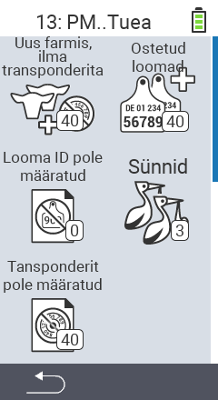

{}
Kui klõpsate menüüelemendil, suunatakse teid vastava funktsiooni kirjeldusele.
{}

<map name="workmap">
  <area shape="rect" coords="3,40,116,160" alt="Uus farmis, ilma transponderita" title="Siin määrate uutele loomadele, kellel pole transponderit, transponderi&#10;Hiireklõps: ava dokumentatsioon" href="/et/docs/new-on-farm/new-no-transponder/">
  <area shape="rect" coords="3,160,116,280" alt="Riiklikku looma ID pole määratud" title="Siin saate vaadata kõiki loomi, kellele ei ole veel määratud riiklikku looma ID-d ja määrata neile riiklik looma ID&#10;Hiireklõps: ava dokumentatsioon" href="/et/docs/new-on-farm/no-national-animal-id-assigned/">
  <area shape="rect" coords="3,280,116,399" alt="Transponder pole määratud" title="Siin saate vaadata kõiki loomi, kellele ei ole veel määratud transponderit ja määrata neile transponder&#10;Hiireklõps: ava dokumentatsioon" href="/et/docs/new-on-farm/no-transponder-assigned/">

  <area shape="rect" coords="116,40,230,160" alt="Ostetud loomad" title="Siin saate vaadata oma praeguseid oste ja eksportida andmeid&#10;Hiireklõps: ava dokumentatsioon" href="/et/docs/new-on-farm/purchased-animals/">
  <area shape="rect" coords="116,160,230,280" alt="Sünnid" title="Siin saate vaadata oma sünnitusi ja luua ekspordifaili&#10;Hiireklõps: ava dokumentatsioon" href="/et/docs/new-on-farm/births/">
  <area shape="rect" coords="1,401,100,439" alt="Tagasi" title="Hüppa tagasi ühe taseme võrra&#10;Hiireklõps: dokumentatsiooni juurde" href="/et/docs/menu/mainmenu/">
</map>
