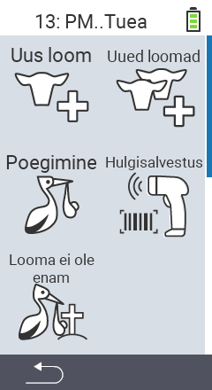

Peamenüü punkti  `Uus` kaudu pääsete alammenüüsse, kus on esitatud 5 alamvalikut:

<map name="workmap">
  <area shape="rect" coords="3,40,116,160" alt="Uus loom" title="Kuidas registreerida uut looma VitalControl seadmega&#10;Hiireklõps: ava dokumentatsioon" href="/et/docs/new/animal/">
  <area shape="rect" coords="3,160,116,280" alt="Poegimine" title="Kuidas registreerida uut poegimist VitalControl seadmega&#10;Hiireklõps: ava dokumentatsioon" href="/et/docs/new/calving/">
  <area shape="rect" coords="3,280,116,399" alt="Looma kaotus" title="Kuidas registreerida looma kaotust VitalControl seadmega&#10;Hiireklõps: ava dokumentatsioon" href="/et/docs/new/animal-loss/">

  <area shape="rect" coords="116,40,230,160" alt="Uued loomad" title="Kuidas luua mitu uut looma VitalControl seadmega ühe tegevusega&#10;Hiireklõps: ava dokumentatsioon" href="/et/docs/new/animals/">
  <area shape="rect" coords="116,160,230,280" alt="Hulgi registreerimine" title="Kasuta vöötkoodi skannerit mitmesuguste loomade registreerimiseks&#10;Hiireklõps: ava dokumentatsioon" href="/et/docs/new/bulk-recording/">

  <area shape="rect" coords="1,401,100,439" alt="Tagasi" title="Hüppa tagasi ühe taseme võrra&#10;Hiireklõps: dokumentatsiooni juurde" href="/et/docs/menu/mainmenu/">
</map>

{}
Igal alammenüül on oma ikoon. Liiguta hiirekursor ikooni peale ülalolevas graafikas ja hoia hetkeks. Ilmub tööriistariba, mis näitab valitud alammenüü teavet. Kui klõpsate mõnel ikoonil, suunatakse teid valitud alammenüü kirjelduse juurde.
{}
