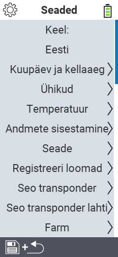

{}
Kui klõpsate menüüelemendil, suunatakse teid vastava funktsiooni kirjelduse juurde.
{}

<map name="workmap">
  <area shape="rect" coords="2,40,230,120" alt="Keel" title="Määrake ja salvestage püsivalt kasutajaliidese keel oma VitalControl seadmes&#10;Hiireklõps: ava dokumentatsioon" href="/et/docs/settings/language/">
  <area shape="rect" coords="2,120,230,160" alt="Kuupäev & Aeg" title="Siin saate määrata kuupäeva ja kellaaja&#10;Hiireklõps: ava dokumentatsioon" href="/et/docs/settings/datetime/">
  <area shape="rect" coords="2,160,230,200" alt="Ühikud" title="Siin valite temperatuuri ja massi ühikud&#10;Hiireklõps: ava dokumentatsioon" href="/et/docs/settings/units/">
  <area shape="rect" coords="2,200,230,240" alt="Temperatuur" title="Määrake temperatuuri seaded oma VitalControl seadme rakenduse jaoks&#10;Hiireklõps: ava dokumentatsioon" href="/et/docs/settings/temperature/">
   <area shape="rect" coords="2,240,230,280" alt="Andmete kogumine" title="Siin salvestate loomade andmekogumiseks olulise teabe&#10;Hiireklõps: ava dokumentatsioon" href="/et/docs/settings/data-acquisition/">
   <area shape="rect" coords="2,280,230,320" alt="Seade" title="Siin saate kohandada mitmesuguseid seadme seadeid&#10;Hiireklõps: ava dokumentatsioon" href="/et/docs/settings/device/">
   <area shape="rect" coords="2,320,230,360" alt="Loomade registreerimine" title="Siin saate kohandada mitmeid tehases määratud standardeid uute loomade registreerimiseks vastavalt teie talu nõuetele.&#10;Hiireklõps: ava dokumentatsioon" href="/et/docs/settings/animal-registration/">
   <area shape="rect" coords="2,360,230,400" alt="Seo transponder" title="Määrake transponderi määramine oma VitalControl seadmes&#10;Hiireklõps: ava dokumentatsioon" href="/et/docs/settings/transponder-linkage/">
   <area shape="rect" coords="2,400,230,439" alt="Eemalda transponder" title="Määrake, kuidas looma ID määratakse pärast transponderi eemaldamist&#10;Hiireklõps: ava dokumentatsioon" href="/et/docs/settings/transponder-linkage/">
   <area shape="rect" coords="2,440,230,480" alt="Talu" title="Salvestage püsivalt oma ametlik kaheteistkohaline riiklik talu ID VitalControl seadmes&#10;Hiireklõps: ava dokumentatsioon" href="/et/docs/settings/farm-number/">
   <area shape="rect" coords="2,482,123,519" alt="Tagasi" title="Hüppa tagasi ühe taseme võrra" href="/et/docs/menu/mainmenu/">
</map>
