
<a class="btn btn-lg btn-primary me-3 mb-4" href="#td-block-2">
  Lue lisää <i class="fas fa-arrow-alt-circle-right ms-2"></i>
</a>
<a class="btn btn-lg btn-secondary me-3 mb-4" href="docs/">
  Dokumentaatio<i class="fa-solid fa-book ms-2 "></i>
</a>

Terveysjohtaminen korkeimmalla tasolla!




{}

**Vähennä** **paperityötä**  

**Paranna** **eläintesi terveyttä**

Pidä **kaikki** **silmissäsi**   

Yhdellä **laitteella**     
{}


{}
 

    

    <button type="button" data-bs-target="#carouselLanguageIndicators" data-bs-slide-to="0" class="active" aria-current="true" aria-label="German"></button>
    <button type="button" data-bs-target="#carouselLanguageIndicators" data-bs-slide-to="1" aria-label="English"></button>
    <button type="button" data-bs-target="#carouselLanguageIndicators" data-bs-slide-to="2" aria-label="Dutch"></button>
    <button type="button" data-bs-target="#carouselLanguageIndicators" data-bs-slide-to="3" aria-label="Finish"></button>
    <button type="button" data-bs-target="#carouselLanguageIndicators" data-bs-slide-to="4" aria-label="French"></button>
    <button type="button" data-bs-target="#carouselLanguageIndicators" data-bs-slide-to="5" aria-label="Russian"></button>
    <button type="button" data-bs-target="#carouselLanguageIndicators" data-bs-slide-to="6" aria-label="Spanish"></button>
    <button type="button" data-bs-target="#carouselLanguageIndicators" data-bs-slide-to="7" aria-label="Bosnian"></button>
    <button type="button" data-bs-target="#carouselLanguageIndicators" data-bs-slide-to="8" aria-label="Bulgarian"></button>
    <button type="button" data-bs-target="#carouselLanguageIndicators" data-bs-slide-to="9" aria-label="Chinese"></button>
    <button type="button" data-bs-target="#carouselLanguageIndicators" data-bs-slide-to="10" aria-label="Czech"></button>
    <button type="button" data-bs-target="#carouselLanguageIndicators" data-bs-slide-to="11" aria-label="Norwegian"></button>
    <button type="button" data-bs-target="#carouselLanguageIndicators" data-bs-slide-to="12" aria-label="Greek"></button>
    <button type="button" data-bs-target="#carouselLanguageIndicators" data-bs-slide-to="13" aria-label="Turkish"></button>
    <button type="button" data-bs-target="#carouselLanguageIndicators" data-bs-slide-to="14" aria-label="Ukrainian"></button>
    <button type="button" data-bs-target="#carouselLanguageIndicators" data-bs-slide-to="15" aria-label="Estonian"></button>
    <button type="button" data-bs-target="#carouselLanguageIndicators" data-bs-slide-to="16" aria-label="Latvian"></button>
    
 

    

      

        <h3>German</h3>
      

      
    

    

      

        <h3>Dutch</h3>
      

      
    

    

      

        <h3>English</h3>
      

      
    

    

      

        <h3>Finnish</h3>
      

      
    

    

      

        <h3>French</h3>
      

      
    

    

      

        <h3>Russian</h3>
      

    
    
  
    

      

        <h3>Spanish</h3>
      

    
    

      

        

          <h3>Bosnian</h3>
        

      
      

      

        

          <h3>Bulgarian</h3>
        

      
      

      

        

          <h3>Chinese</h3>
        

      
      

      

        

          <h3>Czech</h3>
        

      
      

      

        

          <h3>Norwegian</h3>
        

      
      

      

        

          <h3>Greek</h3>
        

      
      
      
      

        

          <h3>Turkish</h3>
        

      
      
 
      

        

          <h3>Ukrainian</h3>
        

      
      
 
      

        

          <h3>Estonian</h3>
        

      
      

      

      

        <h3>Latvian</h3>
      

      
    
  
  

  <button class="carousel-control-prev" type="button" data-bs-target="#carouselLanguagesAutoplaying" data-bs-slide="prev" style="left: 0px; top: 37px; height: 320px;">
    
    Iepriekšējais
  </button>
  <button class="carousel-control-next" type="button" data-bs-target="#carouselLanguagesAutoplaying" data-bs-slide="next" style="right: 0px; top: 37px; height: 320px;">
    
    Nākamais
  </button>

{}

{}
 

    

    <button type="button" data-bs-target="#carouselActionsIndicators" data-bs-slide-to="0" class="active" aria-current="true" aria-label="Lämpötila"></button>
    <button type="button" data-bs-target="#carouselActionsIndicators" data-bs-slide-to="1" aria-label="Punnitus"></button>
    <button type="button" data-bs-target="#carouselActionsIndicators" data-bs-slide-to="2" aria-label="Arviointi"></button>
    <button type="button" data-bs-target="#carouselActionsIndicators" data-bs-slide-to="3" aria-label="Toimintaketju"></button>
    <button type="button" data-bs-target="#carouselActionsIndicators" data-bs-slide-to="4" aria-label="Hälytys"></button>
    <button type="button" data-bs-target="#carouselActionsIndicators" data-bs-slide-to="5" aria-label="Valvonta"></button>
    <button type="button" data-bs-target="#carouselActionsIndicators" data-bs-slide-to="6" aria-label="Eläimen historia"></button>
    <button type="button" data-bs-target="#carouselActionsIndicators" data-bs-slide-to="7" aria-label="Muokkaa"></button>
    <button type="button" data-bs-target="#carouselActionsIndicators" data-bs-slide-to="8" aria-label="Poista rekisteröinti"></button>
    <button type="button" data-bs-target="#carouselActionsIndicators" data-bs-slide-to="9" aria-label="Eläimen katoaminen"></button>
    <button type="button" data-bs-target="#carouselActionsIndicators" data-bs-slide-to="10" aria-label="Yhdistä lähetin"></button>
    <button type="button" data-bs-target="#carouselActionsIndicators" data-bs-slide-to="11" aria-label="Irrota lähetin"></button>
    <button type="button" data-bs-target="#carouselActionsIndicators" data-bs-slide-to="12" aria-label="Yhdistä eläimen tunniste"></button>
    <button type="button" data-bs-target="#carouselActionsIndicators" data-bs-slide-to="13" aria-label="Yhdistä eläimen elektroninen tunniste"></button>
  

    

      

        <h3>Lämpötila</h3>
      

      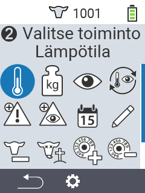
    

    

      

        <h3>Punnitus</h3>
      

      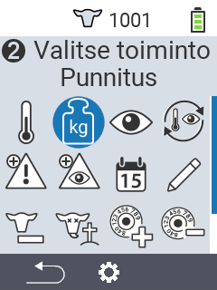
    

    

      

        <h3>Arviointi</h3>
      

      
    

    

      

        <h3>Toimintaketju</h3>
      

      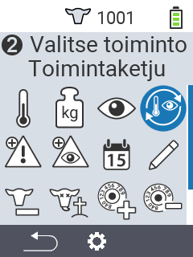
    

    

      

        <h3>Hälytys</h3>
      

      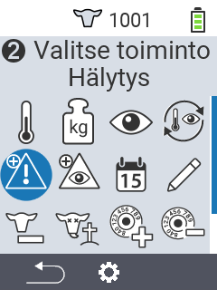
    

    

      

        <h3>Valvonta</h3>
      

      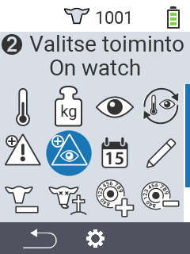
    

    

      

        <h3>Eläimen historia</h3>
      

      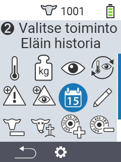
    

    

      

        <h3>Muokkaa</h3>
      

      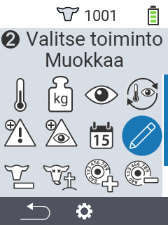
    

    

      

        <h3>Poista rekisteröinti</h3>
      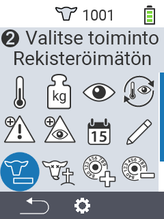
      

    

    

      

        <h3>Eläimen katoaminen</h3>
      

      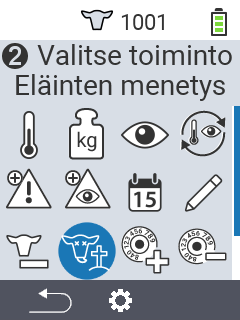
    

    

      

        <h3>Yhdistä lähetin</h3>
      

      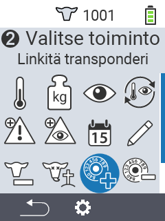
    

    

      

        <h3>Irrota lähetin</h3>
      

      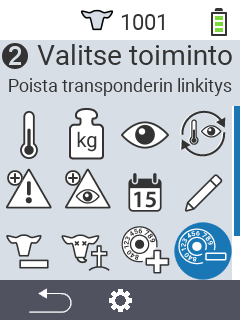
    
      
    

      

        <h3>Yhdistä eläimen tunniste</h3>
      

      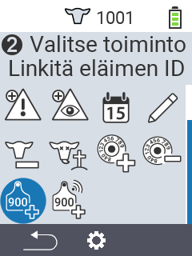
    
   
    

      

        <h3>Yhdistä eläimen tunniste</h3>
      

      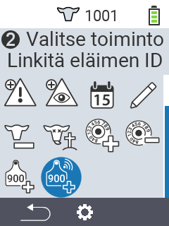
    
             
  

  <button class="carousel-control-prev" type="button" data-bs-target="#carouselActionsAutoplaying" data-bs-slide="prev" style="left: 0px; top: 37px; height: 320px;">
    
    Edellinen
  </button>
  <button class="carousel-control-next" type="button" data-bs-target="#carouselActionsAutoplaying" data-bs-slide="next" style="right: 0px; top: 37px; height: 320px;">
    
    Seuraava
  </button>

{}

{}
 

    

    <button type="button" data-bs-target="#carouselListsIndicators" data-bs-slide-to="0" class="active" aria-current="true" aria-label="Hälytys"></button>
    <button type="button" data-bs-target="#carouselListsIndicators" data-bs-slide-to="1" aria-label="Valvonnassa"></button>
    <button type="button" data-bs-target="#carouselListsIndicators" data-bs-slide-to="2" aria-label="Toimenpide"></button>
    <button type="button" data-bs-target="#carouselListsIndicators" data-bs-slide-to="3" aria-label="Tuoreet lehmät"></button>
    <button type="button" data-bs-target="#carouselListsIndicators" data-bs-slide-to="4" aria-label="Kuivatut lehmät"></button>
  

    

      

        <h3>Hälytys</h3>
      

      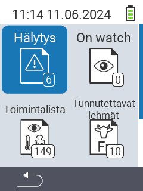
    

    

      

        <h3>Valvonnassa</h3>
      

      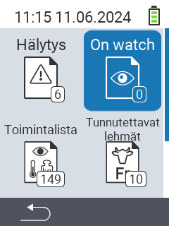
    

    

      

        <h3>Toimintalista</h3>
      
      
      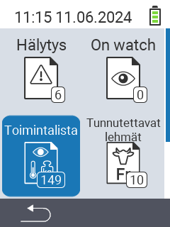
    

    

      

        <h3>Tuoreet lehmät</h3>
      

      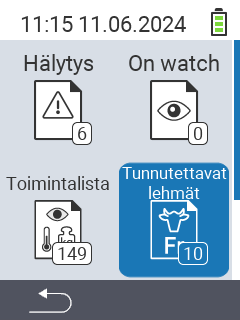
    

    

      

        <h3>Kuivatut lehmät</h3>
      

    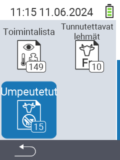
    

  

  <button class="carousel-control-prev" type="button" data-bs-target="#carouselListsAutoplaying" data-bs-slide="prev" style="left: 0px; top: 37px; height: 320px;">
    
    Edellinen
  </button>
  <button class="carousel-control-next" type="button" data-bs-target="#carouselListsAutoplaying" data-bs-slide="next" style="right: 0px; top: 37px; height: 320px;">
    
    Seuraava
  </button>

{}

{}
 

    

    <button type="button" data-bs-target="#carouselListsIndicators" data-bs-slide-to="0" class="active" aria-current="true" aria-label="Arvioinnin paino"></button>
    <button type="button" data-bs-target="#carouselListsIndicators" data-bs-slide-to="1" aria-label="Arvioinnin lämpötila"></button>
    <button type="button" data-bs-target="#carouselListsIndicators" data-bs-slide-to="2" aria-label="Arvioinnin arvosana"></button>
    <button type="button" data-bs-target="#carouselListsIndicators" data-bs-slide-to="3" aria-label="Arvioinnin kuolleisuus"></button>
  

    

      

        <h3>Paino</h3>
      
 
      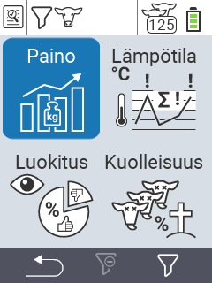
    

    

      

        <h3>Lämpötila</h3>
      
 
      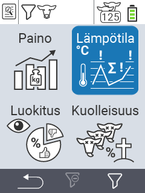
    

    

      

        <h3>Arvosana</h3>
      
 
      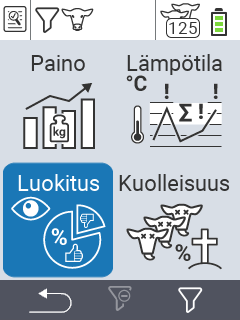
    

    

      

        <h3>Kuolleisuus</h3>
      
 
      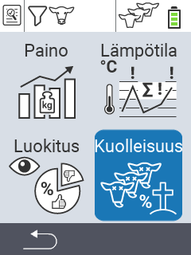
    

  

  <button class="carousel-control-prev" type="button" data-bs-target="#carouselEvaluationAutoplaying" data-bs-slide="prev" style="left: 0px; top: 37px; height: 320px;">
    
    Edellinen
  </button>
  <button class="carousel-control-next" type="button" data-bs-target="#carouselEvaluationAutoplaying" data-bs-slide="next" style="right: 0px; top: 37px; height: 320px;">
    
    Seuraava
  </button>

{}


{}

Sopii useille **eläintyypeille** eri **ikäisille**

{}


{}
 

 
{}

{}
 

 
{}

{}
 

 
{}



{}

Meidän **vahvuutemme** teitä varten

{}


{}
 
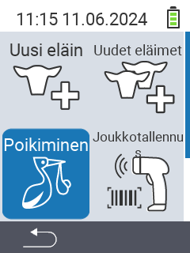
 
{}

{}
 
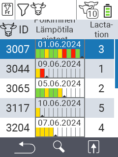
 
{}

{}
 
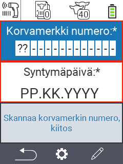
 
{}

{}
 
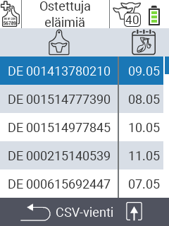
 
{}



{}
Urban sosiaalisessa mediassa

{}

{}

{}
{}

{}
{}

{}
{}

{}
{}


