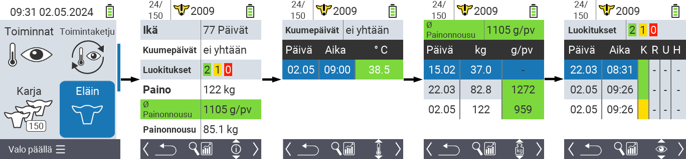
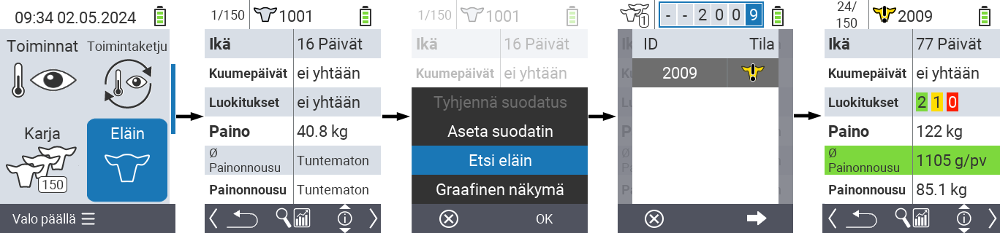
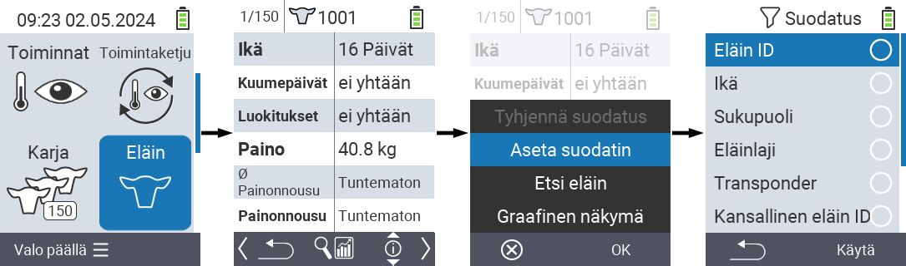

## Eläin {#animal}

Yksittäisen eläimen toiminto mahdollistaa tärkeiden tietojen, kuten painon, lämpötilan ja arvioinnin, tarkastelun kustakin eläimestä. Voit aina valita, näytetäänkö tiedot graafisesti tai listana. Yksittäisen eläimen toiminnon käyttämiseksi toimi seuraavasti:

1. Valitse VitalControl-laitteesi päävalikosta  `` ja paina ``-nappia.

2. Avautuu näkymä tärkeimmistä eläintiedoista. Näytön yläreuna näyttää, minkä eläimen tietoja parhaillaan katsot. Käytä `F3`-näppäintä vaihtaaksesi eläintiedon , lämpötilan , painon   ja arvioinnin  välillä.

{}
Kussakin tietonäkymässä sinulla on mahdollisuus [etsiä eläintä](#search-animal), asettaa [suodatin](#set-filter) ja vaihtaa [graafiseen näkymään](#set-graphical-view).
Voit myös vaihtaa yksittäisten eläinten välillä milloin tahansa käyttämällä nuolinäppäimiä ◁ ▷.
{}

### Aseta graafinen näkymä {#set-graphical-view}

1. Paina keskimmäistä yläpuolella olevaa `On/Off`-nappia  avataksesi ponnahdusvalikon. Tässä valikossa voit valita toiminnot ``, `` tai ``.

2. Valitse `` nuolinäppäimillä △ ▽ ja vahvista ``.

### Etsi eläin {#search-animal}

1. Paina keskimmäistä yläpuolella olevaa `On/Off` -nappia  avataksesi ponnahdusvalikon. Tässä valikossa voit valita toiminnoista ``, `` tai ``.

2. Valitse `` nuolinäppäimillä △ ▽ ja vahvista ``:lla.

3. Käytä nuolinäppäimiä △ ▽ ◁ ▷ valitaksesi haluamasi eläimen numeron ja vahvista ``:lla.

### Aseta suodatin {#set-filter}

1. Paina keskimmäistä yläpuolella olevaa `On/Off` -nappia  avataksesi ponnahdusvalikon. Tässä valikossa voit valita toiminnoista ``, `` tai ``.

2. Valitse `` nuolinäppäimillä △ ▽ ja vahvista ``:lla.
Ohjeet suotimen käyttöön löydät [täältä]().

