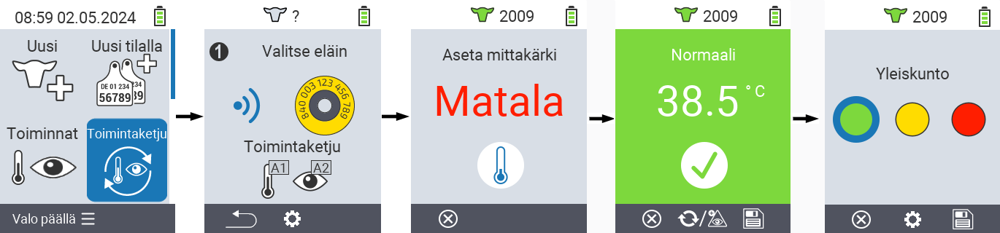
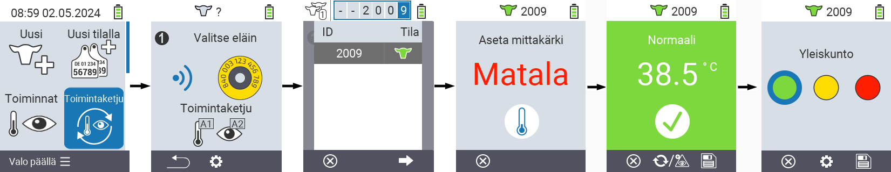
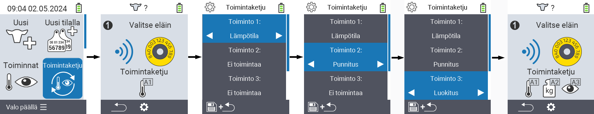

## Toimintaketju

Toimintaketju mahdollistaa useiden toimintojen automaattisen suorittamisen eläimelle peräkkäin. Voit esimerkiksi valita toiminnot `Mittaa lämpötila` ja `Arviointi`. Kun suoritat toimintaketjun, voit ensin mitata eläimesi lämpötilan ja kirjata arvioinnin välittömästi sen jälkeen.

### Käytä toimintaketjua

1. VitalControl-laitteesi päävalikossa valitse valikkokohta &nbsp;&nbsp; `Toimintaketju` ja paina `OK`-nappia.

2. Joko skannaa eläin transponderilla tai vahvista painamalla `OK` ja käytä nuolinäppäimiä △ ▽ ◁ ▷ syöttääksesi halutun eläin-ID:n.

3. Toimintaketju suoritetaan nyt. Kun kaikki toimintaketjun toiminnot on suoritettu, seuraava eläin voidaan valita suoraan.



{}

{}
{}

{}


### Aseta toimintaketju

1. VitalControl-laitteesi päävalikossa valitse valikkokohta &nbsp;&nbsp; `Toimintaketju` ja paina `OK`-nappia.

2. Käytä nappia `F2` &nbsp;&nbsp; (`asetukset`).

3. Ponnahdusikkuna avautuu. Käytä nuolinäppäimiä △ ▽ valitaksesi listatuista toiminnoista 1 - 4 (voit suorittaa jopa neljä toimintoa peräkkäin). Käytä nuolinäppäimiä ◁ ▷ valitaksesi halutun toiminnon kyseiselle toiminnolle. Tallenna asetukset `F1`-näppäimellä &nbsp;&nbsp;.

4. Jos haluat nollata koko toimintoketjun, valitse alavalikosta vaihtoehto `Nollaa toimintoketju` käyttäen nuolinäppäimiä △ ▽ ja vahvista painamalla `OK`.

    

{}
Yksittäisten toimintojen yhteydessä sinulla on samat asetusvaihtoehdot kuin kuvattu luvussa [Toiminnot](../actions) kullekin yksittäiselle toiminnolle.
{}

{}
Toimintoketjun aloitusnäytön symbolit näyttävät, mitkä toiminnot olet asettanut ja missä järjestyksessä.
{}
