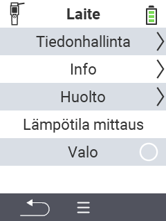

{}
Jos napsautat valikkokohtaa, sinut ohjataan kyseisen toiminnon kuvaussivulle.
{}

<map name="workmap">
  <area shape="rect" coords="2,40,238,80" alt="Tiedonhallinta" title="Suorita tietovarmuuskopiot, vie tietosi ja nollaa laite&#10;Hiiren napsautus: avaa dokumentaatio" href="/fi/docs/device/data-management/">
  <area shape="rect" coords="2,80,238,120" alt="Tieto" title="Näytä tärkeät ohjelmisto- ja laitetiedot&#10;Hiiren napsautus: avaa dokumentaatio" href="/fi/docs/device/info/">
  <area shape="rect" coords="2,120,238,160" alt="Huolto" title="Tarkista laitteesi ajurit, päivitä laiteohjelmistosi ja suorita kantomatkan testi&#10;Hiiren napsautus: avaa dokumentaatio" href="/fi/docs/device/service/">
  <area shape="rect" coords="2,160,238,200" alt="Lämpötilan mittaus" title="Testaa laitteesi lämpötilanmittaus&#10;Hiiren napsautus: avaa dokumentaatio" href="/fi/docs/device/temperature-measurement/">
  <area shape="rect" coords="2,200,238,240" alt="Taskulamppu" title="Kytke VitalControl-laitteesi valo päälle tai pois&#10;Hiiren napsautus: avaa dokumentaatio" href="/fi/docs/device/flashlight/">

  <area shape="rect" coords="2,282,97,318" alt="Takaisin" title="Hyppää takaisin yksi taso" href="/fi/docs/menu/mainmenu/">
</map>
