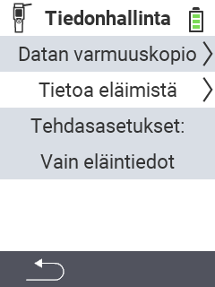

{}
Jos napsautat valikkokohtaa, sinut ohjataan kyseisen toiminnon kuvaussivulle.
{}

<map name="workmap">
  <area shape="rect" coords="2,40,238,80" alt="Tietojen varmuuskopio" title="Ohjeet varmuuskopion luomiseen löytyvät täältä&#10;Hiiren napsautus: avaa dokumentaatio" href="/fi/docs/device/data-management/data-backup/">

  <area shape="rect" coords="2,80,238,120" alt="Eläintiedot" title="Ohjeet varmuuskopion palauttamiseen löytyvät täältä&#10;Hiiren napsautus: avaa dokumentaatio" href="/fi/docs/device/data-management/animal-data/">

  <area shape="rect" coords="2,120,238,200" alt="Tehdasasetusten palautus" title="Kaikki tiedot ja ohjeet laitteen ja eläintietojen nollaamiseen löytyvät täältä&#10;Hiiren napsautus: avaa dokumentaatio" href="/fi/docs/reset/">

  <area shape="rect" coords="2,282,120,319" alt="Takaisin" title="Kaikki tiedot ja ohjeet eläintietojen viemiseen löytyvät täältä&#10;Hiiren napsautus: avaa dokumentaatio" href="/fi/docs/device/">
</map>
