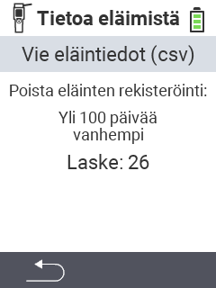

<map name="workmap">
  <area shape="rect" coords="2,40,238,80" alt="Vie eläintiedot (csv)" title="Vie eläintietosi&#10;Hiiren klikkaus: avaa dokumentaatio" href="/fi/docs/data-export/usb-drive/">

  <area shape="rect" coords="2,80,238,200" alt="Poista eläimet rekisteristä" title="Määritä ikä, josta lähtien eläimet tulisi poistaa rekisteristä&#10;Hiiren klikkaus: avaa dokumentaatio" href="/fi/docs/device/data-management/animal-data/unregister-animal/">

  <area shape="rect" coords="2,282,120,319" alt="Takaisin" title="Kaikki tiedot ja ohjeet eläintietojen viemiseksi löytyvät täältä&#10;Hiiren klikkaus: avaa dokumentaatio" href="/fi/docs/device/data-management/">
</map>
