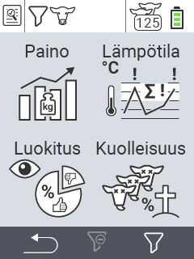

{}
Jos klikkaat valikkokohtaa, sinut ohjataan kyseisen toiminnon kuvaukseen.
{}

<map name="workmap">
  <area shape="rect" coords="3,40,116,160" alt="Paino" title="Arvioi tallennettua tietoasi Paino-osiossa&#10;Hiiren klikkaus: avaa dokumentaatio" href="/fi/docs/evaluation/weight/">
  <area shape="rect" coords="3,160,116,279" alt="Arvostelu" title="Arvioi tallennettua tietoasi arvosteluosiossa&#10;Hiiren klikkaus: avaa dokumentaatio" href="/fi/docs/evaluation/rating/">

  <area shape="rect" coords="116,40,238,160" alt="Lämpötila" title="Arvioi tallennettua tietoasi Lämpötila-osiossa&#10;Hiiren klikkaus: avaa dokumentaatio" href="/fi/docs/evaluation/temperature/">
  <area shape="rect" coords="116,160,238,279" alt="Kuolleisuus" title="Arvioi tallennettua tietoasi kuolleisuusosiossa&#10;Hiiren klikkaus: avaa dokumentaatio" href="/fi/docs/evaluation/mortality/">

  <area shape="rect" coords="150,282,238,319" alt="Suodatin" title="Aseta suodatin&#10;Hiiren klikkaus: dokumentaatioon" href="/fi/docs/filter">
  <area shape="rect" coords="2,282,95,319" alt="Takaisin" title="Hyppää takaisin yksi taso&#10;Hiiren klikkaus: dokumentaatioon" href="/fi/docs/menu/mainmenu/">
</map>
