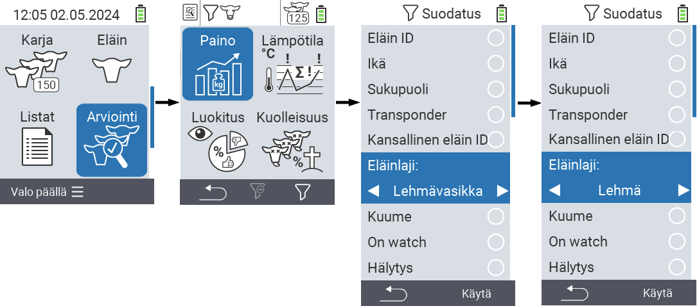
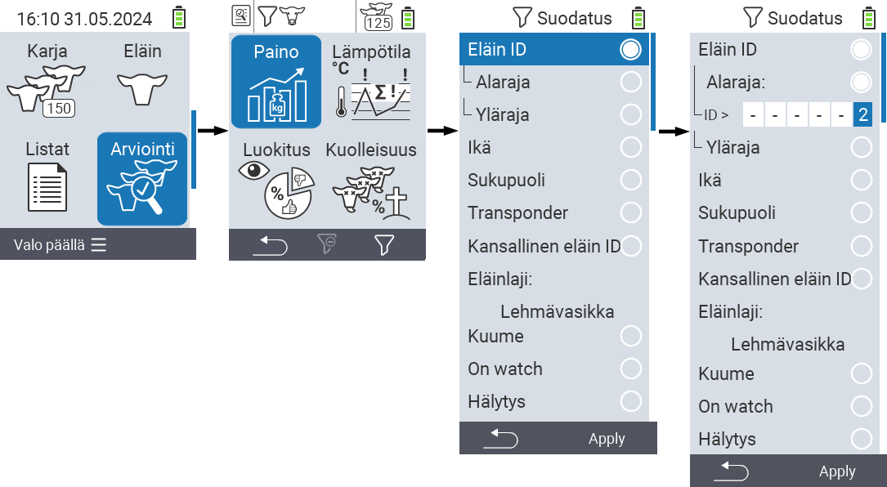
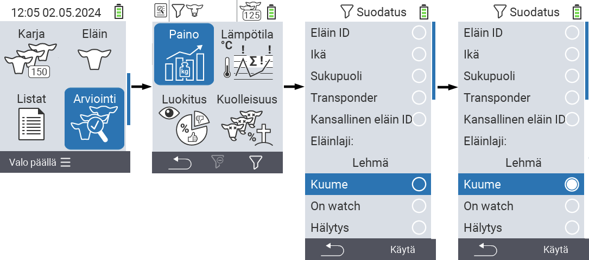

## Suodattimien käyttö

{}
Suodatin auttaa sinua suorittamaan valinnan suodatinkriteerien avulla valikkojen `Lauma`, `Listat` ja `Arviointi` kohdissa VitalControl-laitteessa. Kun käytät suodatinta, näytön yläosaan ilmestyy erilaisia suodatinkriteereitä kuvaavia symboleja. Nämä symbolit auttavat sinua selvittämään, onko ja mitä suodatinkriteereitä on aktivoitu. Esimerkiksi, jos asetat `Sukupuoli`-suodattimen miehille, laite käyttää vain urospuolisia eläimiä. Esimerkiksi, jos aktivoit myös `Tarkkailussa`-suodattimen, laite käyttää vain tarkkailulistalla olevia urospuolisia eläimiä.
{}

Suodattimen luomiseksi arvioinneissa toimi seuraavasti:

1. Valitse ylävalikon kohdasta  `Arviointi` painamalla `F3`-näppäintä  kerran. Ylävalikon kohtien  `Listat` ja  `Lauma` alavalikoissa sinun tulee painaa näppäintä kahdesti.

2. Alavalikko avautuu, jossa voit asettaa kaikki suodatinvaihtoehdot. Voit suodattaa `Eläin ID`, `Ikä`, `Sukupuoli`, `Transponderi`, `Kansallinen eläin ID`, `Kuume`, `Tarkkailussa`, `Eläimen tyyppi` ja `Hälytys` perusteella.

3. Suodattimille `Eläimen tyyppi`, `Sukupuoli`, `Transponderi` ja `Kansallinen eläin ID` siirry vastaavaan alueeseen ja vahvista `OK`. Käytä nuolinäppäimiä ◁ ▷ määrittääksesi halutun asetuksen. Käytä `F3`-näppäintä `Käytä` valitun asetuksen paikalleen asettamiseksi. Hylätäksesi suodatinmuutokset, paina `F1`-näppäintä &nbsp;&nbsp;.

4. Suodattimille `Eläimen ID` ja `Ikä` valitse vastaava kriteeri ja vahvista painamalla `OK`. Sinulle näytetään nyt ala- ja yläraja. Siirry haluttuun rajaan käyttämällä nuolinäppäimiä △ ▽ ja vahvista painamalla `OK` kahdesti. Nyt voit asettaa halutun numeron käyttämällä nuolinäppäimiä ◁ ▷ ja nuolinäppäimiä △ ▽. Kun kaikki asetukset ovat oikein, paina `OK` uudelleen poistuaksesi asetustilasta ja soveltaaksesi valitut suodattimet `F3`-näppäimellä `Käytä`. `F1`-näppäimellä &nbsp;&nbsp; voit halutessasi hylätä muutoksesi.

5. Suodattimille `Kuume`, `Tarkkailussa` ja `Hälytys` on mahdollisuus ottaa niiden käyttö pois päältä tai päälle. Tee tämä valitsemalla vastaava suodatin ja vahvistamalla `OK`. Suodatin on nyt aktiivinen. Vahvista uudelleen `OK`:lla poistaaksesi suodattimen käytöstä.

6. Kun olet asettanut kaikki suodattimet, käytä `F3`-näppäintä `Käytä` asettaaksesi määritellyt suodattimet paikoilleen tai paina `F1`-näppäintä  hylätäksesi muutokset suodattimiin.
