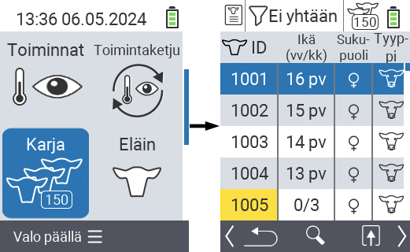
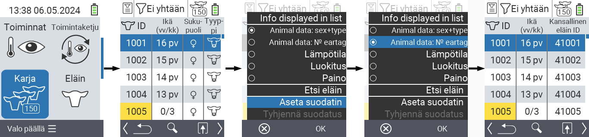
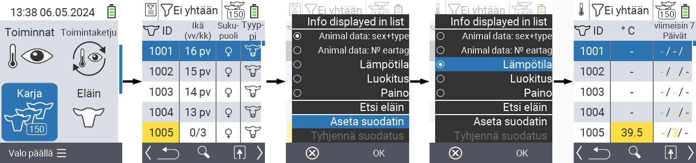
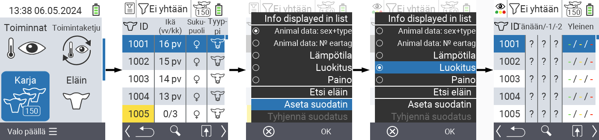
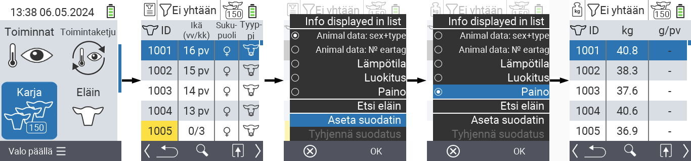
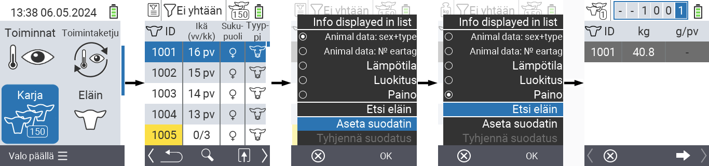
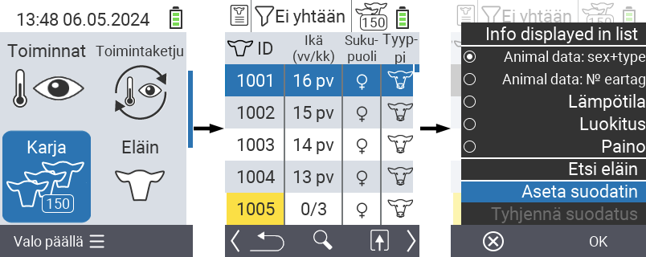
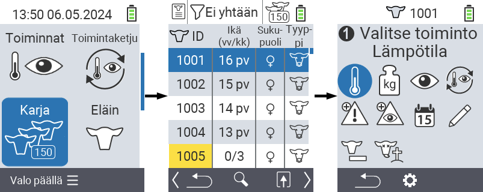

## Lauma {#herd}

Lauma-valikossa voit tarkastella koko laumaasi, etsiä yksittäisiä eläimiä ja näyttää tärkeitä tietoja. Sinulla on seuraavat mahdollisuudet:

- Näytä [eläintiedot](#view-animal-data)
- Näytä [lämpötilatiedot](#display-temperature)
- Näytä [luokitustiedot](#view-rating)
- Näytä [painotiedot](#display-weight)
- [Etsi eläin](#search-animal)
- Aseta [suodatin](#set-filter)
- [Toiminnot](#call-action-menu)

### Valmisteluvaiheet {#preparatory-steps}

1. Valitse VitalControl-laitteesi päävalikosta kohta  `Karja` ja paina `OK`-nappia.

2. Laumasi yleiskatsaus avautuu.

    

### Näytä eläintiedot {#view-animal-data}

1. Suorita valmisteluvaiheet.

2. Käytä `F3`-näppäintä &nbsp;&nbsp; avataksesi ponnahdusvalikon, joka listaa tietokategoriat, joita voidaan näyttää laumalistassa. Käytä nuolinäppäimiä △ ▽ korostaaksesi riviä `Eläintiedot: sukupuoli + tyyppi` tai `Eläintiedot: N0 korvamerkki` ja valitse tämä kategoria painamalla keskellä olevaa `OK`-nappia tai `F3`-näppäintä `OK`. Kaksi valintavaihtoehtoa eroavat tietopalkin näytössä.

3. Eläintiedot näytetään nyt laumalistasi sisältönä.

4. Vaihtoehtoisesti voit käyttää nuolinäppäimiä ◁ ▷ vaihtaaksesi eri näyttövaihtoehtojen välillä.

    

{}
Oletuksena eläintiedot näytetään ensin. Vain kun olet esimerkiksi näyttänyt painon, sinun on asetettava eläintietojen näyttö uudelleen.
{}

### Näytä lämpötila {#display-temperature}

1. Suorita valmisteluvaiheet.

2. Käytä `F3`-näppäintä &nbsp;&nbsp; avataksesi ponnahdusvalikon, joka listaa tietokategoriat, jotka voidaan näyttää laumalistassa. Käytä nuolinäppäimiä △ ▽ korostaaksesi rivin `Lämpötila` ja valitse tämä kategoria painamalla keskimmäistä `OK`-näppäintä tai `F3`-näppäintä `OK`.

3. Lämpötilatiedot näytetään nyt laumalistan sisältönä.

4. Vaihtoehtoisesti voit käyttää nuolinäppäimiä ◁ ▷ vaihtaaksesi eri näyttövaihtoehtojen välillä.

    

### Näytä arvostelu {#view-rating}

1. Suorita valmisteluvaiheet.

2. Käytä `F3`-näppäintä &nbsp;&nbsp; avataksesi ponnahdusvalikon, joka listaa tietokategoriat, jotka voidaan näyttää laumalistassa. Käytä nuolinäppäimiä △ ▽ korostaaksesi rivin `Luokitus` ja valitse tämä kategoria painamalla keskimmäistä `OK`-näppäintä tai `F3`-näppäintä `OK`.

3. Arvostelutiedot näytetään nyt laumalistan sisältönä.

4. Vaihtoehtoisesti voit käyttää nuolinäppäimiä ◁ ▷ vaihtaaksesi eri näyttövaihtoehtojen välillä.

    

### Näytä paino {#display-weight}

1. Suorita valmisteluvaiheet.

2. Käytä `F3`-näppäintä &nbsp;&nbsp; avataksesi ponnahdusvalikon, joka listaa tietokategoriat, jotka voidaan näyttää laumalistassa. Käytä nuolinäppäimiä △ ▽ korostaaksesi rivin `Paino` ja valitse tämä kategoria painamalla keskimmäistä `OK`-näppäintä tai `F3`-näppäintä `OK`.

3. Painotiedot näytetään nyt laumalistan sisältönä.

4. Vaihtoehtoisesti voit käyttää nuolinäppäimiä ◁ ▷ vaihtaaksesi eri näyttövaihtoehtojen välillä.

    

### Etsi eläin {#search-animal}

1. Suorita valmisteluvaiheet.

2. Käytä `F3`-näppäintä &nbsp;&nbsp; avataksesi ponnahdusvalikon, joka listaa erilaisia vaihtoehtoja. Käytä nuolinäppäimiä △ ▽ korostaaksesi toiminnon `Etsi eläin` ja kutsu hakutoiminto käyttöön painamalla keskimmäistä `OK`-näppäintä tai `F3`-näppäintä `OK`. Vaihtoehtoisesti voit käyttää `On/Off`-näppäintä  heti ensimmäisen vaiheen jälkeen.

3. Käytä nuolinäppäimiä △ ▽ ◁ ▷ syöttääksesi haluamasi eläimen numeron ja vahvista painamalla `OK`.

    

### Aseta suodatin {#set-filter}

1. Suorita valmisteluvaiheet.

2. Käytä `F3`-näppäintä &nbsp;&nbsp; kutsuaksesi esiin ponnahdusvalikon, joka listaa eri vaihtoehtoja. Käytä nuolinäppäimiä △ ▽ korostaaksesi toiminnon `Aseta suodatin` ja kutsu suodatintoiminto esiin painamalla keskimmäistä `OK`-näppäintä tai `F3`-näppäintä `OK`.

3. Tietoa suodattimen käytöstä löytyy [täältä]().

    

### Kutsu toimintovalikko {#call-action-menu}

Sinulla on aina mahdollisuus kutsua esiin eläimen toimintovalikko.

1. Suorita valmisteluvaiheet.

2. Valitse eläin listalta nuolinäppäimillä △ ▽ ja vahvista `OK`:lla.

3. Toimintovalikko on nyt avoinna. Tietoa tämän käytöstä löytyy [täältä](../actions).

4. Palaa laumalistaan `F3`-näppäimellä.

    
