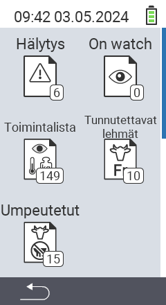

{}
Jos klikkaat valikkokohtaa, sinut ohjataan kyseisen toiminnon kuvaukseen.
{}

<map name="workmap">
  <area shape="rect" coords="3,40,116,160" alt="Hälytyslista" title="Tutustu hälytyslistaasi&#10;Hiiren klikkaus: avaa dokumentaatio" href="/fi/docs/lists/alarm/">
  <area shape="rect" coords="3,160,116,280" alt="Toimintalista" title="Tutustu toimintalistasi.&#10;Hiiren klikkaus: avaa dokumentaatio" href="/fi/docs/lists/actions/">
  <area shape="rect" coords="3,280,116,399" alt="Kuivat lehmät -lista" title="Tutustu kuivien lehmien listaasi&#10;Hiiren klikkaus: avaa dokumentaatio" href="/fi/docs/lists/dry-cows/">

  <area shape="rect" coords="116,40,230,160" alt="Tarkkailulistalla" title="Tutustu tarkkailulistasi&#10;Hiiren klikkaus: avaa dokumentaatio" href="/fi/docs/lists/on-watch/">
  <area shape="rect" coords="116,160,230,280" alt="Tuoreet lehmät" title="Tutustu tuoreiden lehmien listaasi&#10;Hiiren klikkaus: avaa dokumentaatio" href="/fi/docs/lists/fresh-cows/">

  <area shape="rect" coords="2,401,115,438" alt="Takaisin" title="Hyppää takaisin yksi taso" href="/fi/docs/menu/mainmenu/">
</map>
