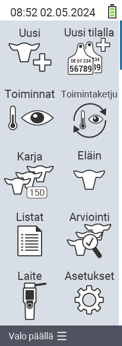

{}
Jos klikkaat valikkokohtaa, sinut ohjataan kyseisen toiminnon kuvaukseen.
{}

<map name="workmap">
  <area shape="rect" coords="3,40,116,160" alt="Uusi" title="Luo uusia eläimiä&#10;Hiiren klikkaus: avaa dokumentaatio" href="/fi/docs/new/">
  <area shape="rect" coords="3,160,116,280" alt="Toiminnot" title="Toiminnot eläimille&#10;Hiiren klikkaus: avaa dokumentaatio" href="/fi/docs/actions/">
  <area shape="rect" coords="3,280,116,400" alt="Lauma" title="Laumavalikko&#10;Hiiren klikkaus: avaa dokumentaatio" href="/fi/docs/herd/">
  <area shape="rect" coords="3,400,116,520" alt="Listat" title="Eläinlistat&#10;Hiiren klikkaus: avaa dokumentaatio" href="/fi/docs/lists/">
  <area shape="rect" coords="3,520,116,634" alt="Laite" title="Laite&#10;Hiiren klikkaus: avaa dokumentaatio" href="/fi/docs/device/">

  <area shape="rect" coords="116,40,230,160" alt="Uusi tilalla" title="Eläinten saapuminen&#10;Hiiren klikkaus: avaa dokumentaatio" href="/fi/docs/new-on-farm/">
  <area shape="rect" coords="116,160,230,280" alt="Toimintaketju" title="Toimintaketju&#10;Hiiren klikkaus: avaa dokumentaatio" href="/fi/docs/chain-of-actions/">
  <area shape="rect" coords="116,280,230,400" alt="Eläin" title="Eläin&#10;Hiiren klikkaus: avaa dokumentaatio" href="/fi/docs/animal/">
  <area shape="rect" coords="116,400,230,520" alt="Arviointi" title="Arviointi&#10;Hiiren klikkaus: avaa dokumentaatio" href="/fi/docs/evaluation/">
  <area shape="rect" coords="116,520,230,634" alt="Asetukset" title="Asetukset&#10;Hiiren klikkaus: avaa dokumentaatio" href="/fi/docs/settings/">
</map>
