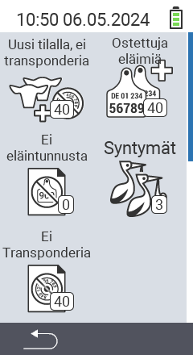

{}
Jos napsautat valikkokohtaa, sinut ohjataan kyseisen toiminnon kuvaukseen.
{}

<map name="workmap">
  <area shape="rect" coords="3,40,116,160" alt="Uutta tilalla, ei lähetintä" title="Tässä voit liittää lähetin uusiin eläimiin, joilla ei ole lähetintä&#10;Hiiren napsautus: avaa dokumentaatio" href="/fi/docs/new-on-farm/new-no-transponder/">
  <area shape="rect" coords="3,160,116,280" alt="Ei kansallista eläin-ID:tä" title="Tässä voit tarkastella kaikkia eläimiä, joille ei ole vielä määritetty kansallista eläin-ID:tä ja määrittää kansallisen eläin-ID:n&#10;Hiiren napsautus: avaa dokumentaatio" href="/fi/docs/new-on-farm/no-national-animal-id-assigned/">
  <area shape="rect" coords="3,280,116,399" alt="Ei lähetintä määritetty" title="Tässä voit tarkastella kaikkia eläimiä, joille ei ole vielä määritetty lähetintä ja määrittää lähetin niille&#10;Hiiren napsautus: avaa dokumentaatio" href="/fi/docs/new-on-farm/no-transponder-assigned/">

  <area shape="rect" coords="116,40,230,160" alt="Ostetut eläimet" title="Tässä voit tarkastella nykyisiä ostoksiasi ja viedä tiedot&#10;Hiiren napsautus: avaa dokumentaatio" href="/fi/docs/new-on-farm/purchased-animals/">
  <area shape="rect" coords="116,160,230,280" alt="Syntymät" title="Tässä voit nähdä syntymäsi ja luoda vientitiedoston&#10;Hiiren napsautus: avaa dokumentaatio" href="/fi/docs/new-on-farm/births/">
  <area shape="rect" coords="1,401,100,439" alt="Takaisin" title="Hyppää takaisin yksi taso&#10;Hiiren napsautus: dokumentaatioon" href="/fi/docs/menu/mainmenu/">
</map>
