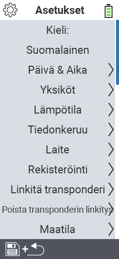

{}
Jos napsautat valikkokohtaa, sinut ohjataan kyseisen toiminnon kuvaussivulle.
{}

<map name="workmap">
  <area shape="rect" coords="2,40,230,120" alt="Kieli" title="Aseta ja tallenna pysyvästi käyttöliittymän kieli VitalControl-laitteellasi&#10;Hiiren napsautus: avaa dokumentaatio" href="/fi/docs/settings/language/">
  <area shape="rect" coords="2,120,230,160" alt="Päivämäärä & Aika" title="Tässä asetat päivämäärän ja ajan&#10;Hiiren napsautus: avaa dokumentaatio" href="/fi/docs/settings/datetime/">
  <area shape="rect" coords="2,160,230,200" alt="Yksiköt" title="Tässä valitset lämpötilan ja massan yksiköt&#10;Hiiren napsautus: avaa dokumentaatio" href="/fi/docs/settings/units/">
  <area shape="rect" coords="2,200,230,240" alt="Lämpötila" title="Aseta lämpötila-asetukset VitalControl-laitteesi sovellukselle&#10;Hiiren napsautus: avaa dokumentaatio" href="/fi/docs/settings/temperature/">
   <area shape="rect" coords="2,240,230,280" alt="Tiedonkeruu" title="Tässä tallennat eläintietojen keruuseen liittyvät tärkeät tiedot&#10;Hiiren napsautus: avaa dokumentaatio" href="/fi/docs/settings/data-acquisition/">
   <area shape="rect" coords="2,280,230,320" alt="Laite" title="Tässä voit säätää erilaisia laiteasetuksia&#10;Hiiren napsautus: avaa dokumentaatio" href="/fi/docs/settings/device/">
   <area shape="rect" coords="2,320,230,360" alt="Eläinten rekisteröinti" title="Tässä voit säätää useita tehdasasetuksia uusien eläinten rekisteröinnistä tilasi vaatimusten mukaisesti.&#10;Hiiren napsautus: avaa dokumentaatio" href="/fi/docs/settings/animal-registration/">
   <area shape="rect" coords="2,360,230,400" alt="Linkitä transponderi" title="Aseta transponderin kohdistus VitalControl-laitteellasi&#10;Hiiren napsautus: avaa dokumentaatio" href="/fi/docs/settings/transponder-linkage/">
   <area shape="rect" coords="2,400,230,439" alt="Irrota transponderi" title="Määritä, miten eläimen tunnus määritetään transponderin irrottamisen jälkeen&#10;Hiiren napsautus: avaa dokumentaatio" href="/fi/docs/settings/transponder-linkage/">
   <area shape="rect" coords="2,440,230,480" alt="Tila" title="Tallenna pysyvästi virallinen kaksitoistamerkkinen kansallinen tilanumerosi VitalControl-laitteeseen&#10;Hiiren napsautus: avaa dokumentaatio" href="/fi/docs/settings/farm-number/">
   <area shape="rect" coords="2,482,123,519" alt="Takaisin" title="Hyppää takaisin yhden tason" href="/fi/docs/menu/mainmenu/">
</map>
